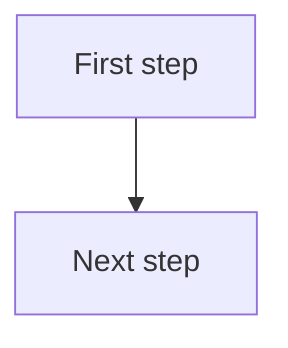

# The What-If Blueprint

**What if business processes were designed for agents first?** A point of view by Nikhil Kasturi.

[](https://nikhil-kasturi.github.io/business-process-agent-frameworks/)
[](#whats-inside)
[](#roadmap)
[](LICENSE)

**[Open the site →](https://nikhil-kasturi.github.io/business-process-agent-frameworks/)**

---

## Why this exists

Most talk about AI agents starts with the technology. This project starts with the work.

Before you can redesign a business process with agents, you need a clear picture of how it runs today: who does what, in what order, and where it breaks. The What-If Blueprint maps that baseline for 162 real business processes, then redesigns them one at a time as *What-If* agent ecosystems. Each redesign shows a named roster of agents, the human checkpoints, the new user journey, and how each pain point gets solved.

## What's inside

| Sector | Categories | Processes | Covers |
|---|---:|---:|---|
| [Retail](https://nikhil-kasturi.github.io/business-process-agent-frameworks/retail.html) | 13 | 40 | E-commerce, stores, merchandising and supply chain, pricing, customer experience, loss prevention |
| [Financial Services](https://nikhil-kasturi.github.io/business-process-agent-frameworks/financial.html) | 12 | 71 | Banking, capital markets, wealth, insurance, payments, corporate finance back office, compliance |
| [Life Sciences](https://nikhil-kasturi.github.io/business-process-agent-frameworks/life-sciences.html) | 17 | 51 | Discovery, clinical trials, regulatory, quality, manufacturing, commercial, medical affairs |
| **Total** | **42** | **162** | |

Processes that overlap with an adjacent industry are tagged, for example *Also Healthcare* or *Also Logistics*.

## How each process page is built

Every process has its own page, built in two stages.

**Stage 1: the baseline** (live for all 162)

1. **What it does:** a two-line summary of the function and why the business depends on it
2. **The traditional flow:** a step-by-step diagram of how it runs today, with a full-screen zoom view
3. **Where it breaks:** the main pain point an agent ecosystem would target

**Stage 2: the What-If redesign** (published process by process)

4. **Tools in use today:** the systems, spreadsheets and handoffs the process relies on
5. **Pain points in depth:** where each one happens, who feels it, and what it costs
6. **Today's critical user journey:** who touches the process and where delays creep in
7. **The What-If agent ecosystem:** named agents with single responsibilities, the orchestration diagram and the human checkpoints
8. **The new critical user journey:** what changes for each person and where they still step in
9. **Before and after:** a side-by-side comparison of the two designs
10. **How each pain point gets solved:** every pain point mapped to the agent or checkpoint that removes it
11. **Business outcomes:** the generic outcomes the redesign could drive

> Impact figures in any redesign are illustrative estimates, never measured results.

## Roadmap

- [x] Map the traditional baseline for 162 processes across three sectors
- [x] Give every process its own page, with zoomable diagrams and light and dark modes
- [ ] Publish What-If redesigns, starting with SME financial operations (accounts payable, accounts receivable, month-end close, treasury, payroll)
- [ ] Add more sectors

Progress is tracked live on the site's home page.

## Site features

- An overview page, one page per sector, and one page per process
- Search and a category index on each sector page
- Diagrams that open full screen, with zoom by buttons, mouse wheel or pinch, and drag to move
- Light mode by default, a dark mode toggle, and layouts that work on phones
- Plain static HTML with no framework and no build dependencies

## Publishing a redesign

1. Find the process page, for example `financial/accounts-payable.html`.
2. Copy [`content/redesigns/TEMPLATE.md`](content/redesigns/TEMPLATE.md) to a file with the same name under the sector folder, for example `content/redesigns/financial/accounts-payable.md`. The sector folders are `retail`, `financial` and `life-sciences`.
3. Fill in the sections. Keep the `##` headings from the template. Any section you leave out keeps showing "Coming soon". Tables, lists and Mermaid diagrams are supported.
4. Rebuild and push:

   ```bash
   python3 scripts/build_site.py
   git add -A
   git commit -m "Publish redesign: Accounts Payable"
   git push
   ```

The process page, its sector page and the home page counter update automatically.

## Editing the baseline

The baseline for each sector lives in one Markdown file under `content/`. Each process follows this pattern:

````markdown
### Process Name *(Optional overlap tag)*
Two-line description of what the process does.

*Pain point: the main place this flow breaks down.*
````

Edit the file, run `python3 scripts/build_site.py`, and push.

## Preview locally

```bash
python3 scripts/build_site.py
python3 -m http.server 8000
```

Then open http://localhost:8000.

## Repository layout

```
.
├── index.html                 Home page (generated)
├── retail.html                Sector pages (generated)
├── financial.html
├── life-sciences.html
├── retail/                    One page per process (generated)
├── financial/
├── life-sciences/
├── content/
│   ├── Retail-Sector-Deep-Dive.md
│   ├── Financial-Sector-Deep-Dive.md
│   ├── Life-Sciences-Sector-Deep-Dive.md
│   └── redesigns/
│       └── TEMPLATE.md        Copy this to publish a redesign
├── scripts/
│   ├── build_site.py          Builds every page from content/
│   └── parse_sectors.py       Reads the sector Markdown files
└── LICENSE                    CC BY 4.0
```

Only edit files in `content/`. Every `.html` file is regenerated by the build script, so direct edits to them will be overwritten.

## Built with

- Static HTML, CSS and a little JavaScript
- [Mermaid](https://mermaid.js.org/) for diagrams
- Python 3 standard library for the build
- GitHub Pages for hosting

## Disclaimer

This is an illustrative reference of common industry practice. It is not based on any specific company, client or employer, and nothing here describes a real organization's systems or results.

## License

The content is licensed under [Creative Commons Attribution 4.0 International (CC BY 4.0)](https://creativecommons.org/licenses/by/4.0/). You may share and adapt it for any purpose, including commercially, as long as you credit **Nikhil Kasturi** and link back to this project.

Suggested credit: *"Based on The What-If Blueprint by Nikhil Kasturi (CC BY 4.0)."*

## Author

**Nikhil Kasturi**, AI solutions architect working on enterprise multi-agent systems.
GitHub: [@Nikhil-Kasturi](https://github.com/Nikhil-Kasturi)

Feedback and suggestions for processes to redesign are welcome through [GitHub issues](https://github.com/Nikhil-Kasturi/business-process-agent-frameworks/issues).
