# Financial Services Sector — Full Breakdown with Traditional Process Flows

Each sub-function below includes: a two-line description, a Mermaid flowchart of how the process traditionally runs today, and the main pain point in that traditional flow.

## Banking

### Retail Banking

#### Account Opening & Onboarding
Verifying customer identity and running KYC checks before an account is created. Sets up the account and links initial funding sources.
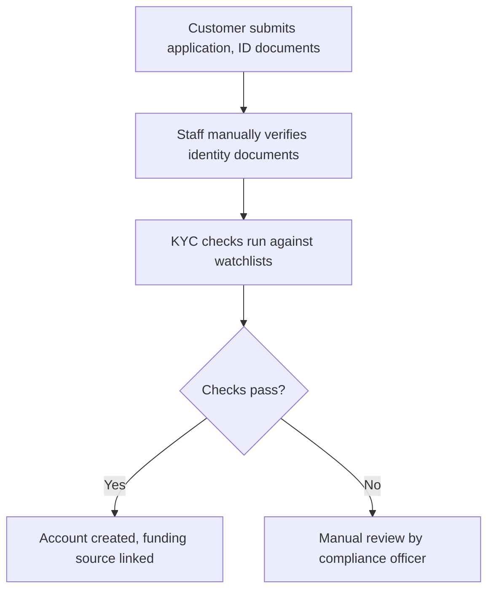
```mermaid
flowchart TD
    A[Customer submits application, ID documents] --> B[Staff manually verifies identity documents]
    B --> C[KYC checks run against watchlists]
    C --> D{Checks pass?}
    D -->|Yes| E[Account created, funding source linked]
    D -->|No| F[Manual review by compliance officer]
```
*Pain point: document verification and edge-case KYC review is manual and slows down onboarding.*

#### Deposit Management
Administering checking and savings products, including interest accrual and account tiering. Covers minimum balance rules and fee structures.
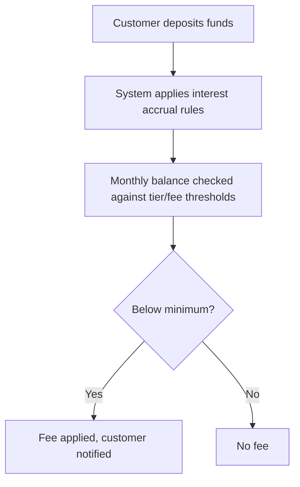
```mermaid
flowchart TD
    A[Customer deposits funds] --> B[System applies interest accrual rules]
    B --> C[Monthly balance checked against tier/fee thresholds]
    C --> D{Below minimum?}
    D -->|Yes| E[Fee applied, customer notified]
    D -->|No| F[No fee]
```
*Pain point: tier/fee rule exceptions often require a service rep to manually waive or explain charges.*

#### Consumer Lending
Originating and underwriting personal loans, auto loans, and credit card origination. Includes credit decisioning and disbursement.
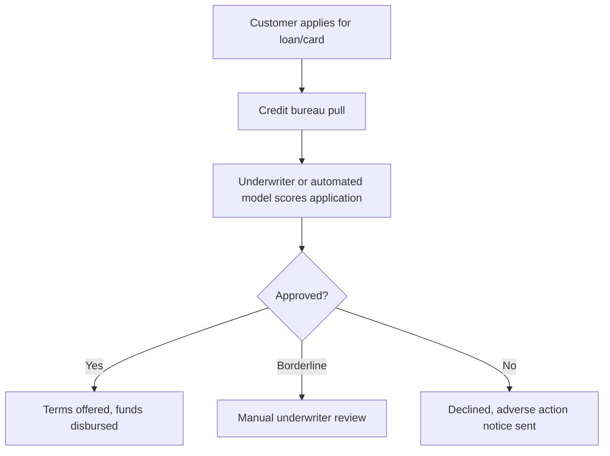
```mermaid
flowchart TD
    A[Customer applies for loan/card] --> B[Credit bureau pull]
    B --> C[Underwriter or automated model scores application]
    C --> D{Approved?}
    D -->|Yes| E[Terms offered, funds disbursed]
    D -->|Borderline| F[Manual underwriter review]
    D -->|No| G[Declined, adverse action notice sent]
```
*Pain point: borderline applications require manual underwriter judgment, slowing turnaround.*

#### Mortgage Origination
Taking a home loan application through underwriting to closing. Coordinates appraisal, title, and closing logistics.
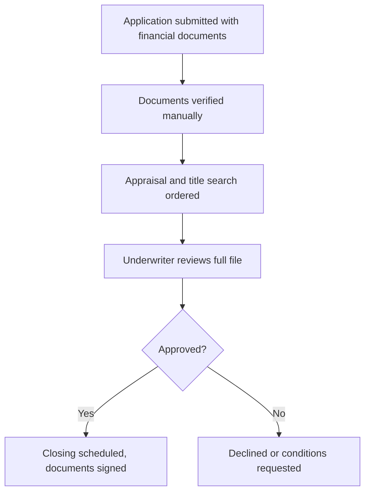
```mermaid
flowchart TD
    A[Application submitted with financial documents] --> B[Documents verified manually]
    B --> C[Appraisal and title search ordered]
    C --> D[Underwriter reviews full file]
    D --> E{Approved?}
    E -->|Yes| F[Closing scheduled, documents signed]
    E -->|No| G[Declined or conditions requested]
```
*Pain point: coordinating appraisal, title, and underwriting across separate parties creates delays and back-and-forth.*

#### Mortgage Servicing
Collecting ongoing payments and managing escrow for taxes and insurance. Handles delinquency outreach and loss mitigation.
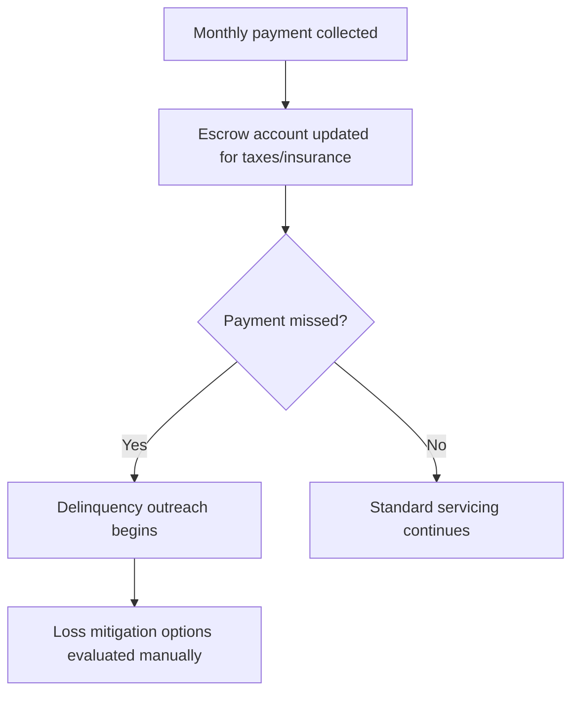
```mermaid
flowchart TD
    A[Monthly payment collected] --> B[Escrow account updated for taxes/insurance]
    B --> C{Payment missed?}
    C -->|Yes| D[Delinquency outreach begins]
    C -->|No| E[Standard servicing continues]
    D --> F[Loss mitigation options evaluated manually]
```
*Pain point: loss mitigation case review is largely manual, and delays can worsen a borrower's situation.*

#### Branch & ATM Operations
Running physical cash handling, teller transactions, and ATM cash replenishment. Includes branch staffing and vault management.
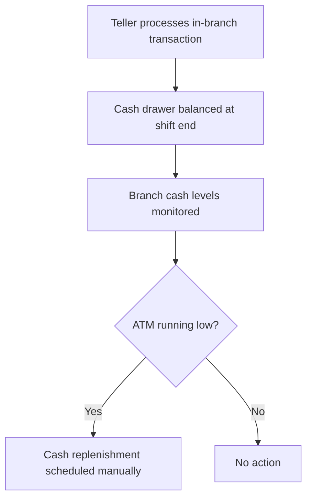
```mermaid
flowchart TD
    A[Teller processes in-branch transaction] --> B[Cash drawer balanced at shift end]
    B --> C[Branch cash levels monitored]
    C --> D{ATM running low?}
    D -->|Yes| E[Cash replenishment scheduled manually]
    D -->|No| F[No action]
```
*Pain point: ATM cash forecasting is often reactive, leading to occasional stockouts or excess idle cash.*

#### Digital/Mobile Banking
Providing online account access, mobile check deposit, and bill pay. Covers app-based authentication and transaction alerts.
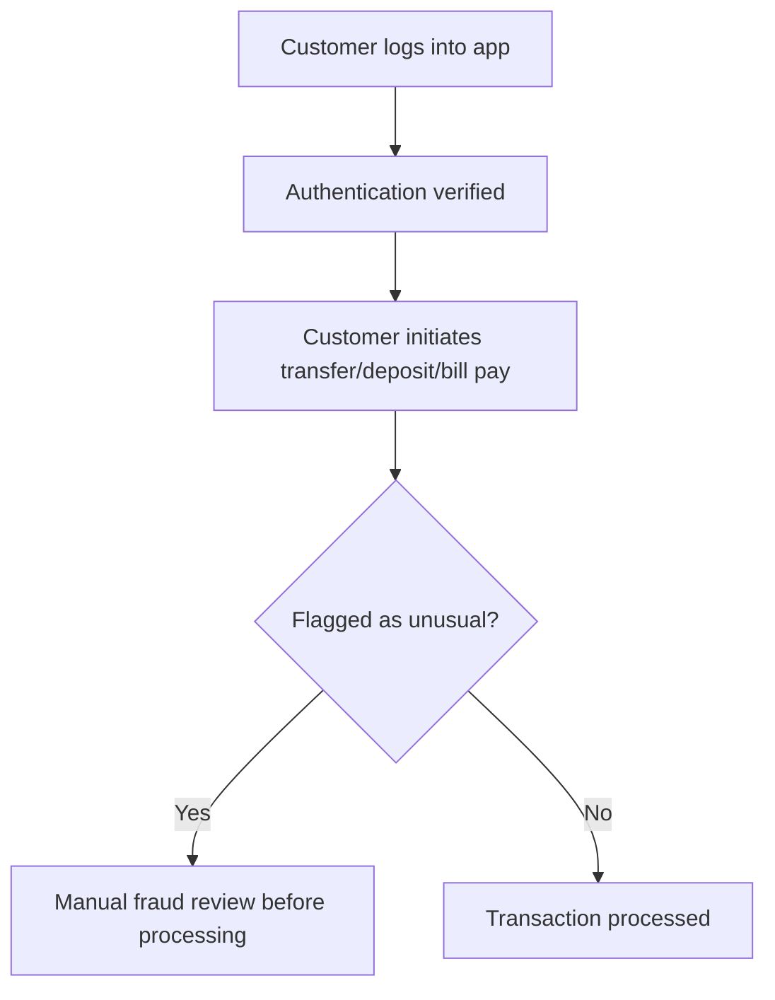
```mermaid
flowchart TD
    A[Customer logs into app] --> B[Authentication verified]
    B --> C[Customer initiates transfer/deposit/bill pay]
    C --> D{Flagged as unusual?}
    D -->|Yes| E[Manual fraud review before processing]
    D -->|No| F[Transaction processed]
```
*Pain point: unusual-activity flags often require a human review step that delays legitimate transactions too.*

### Commercial & Corporate Banking

#### Business Lending
Originating term loans, revolving credit lines, and SBA-backed loans for businesses. Includes covenant setting and ongoing credit monitoring.
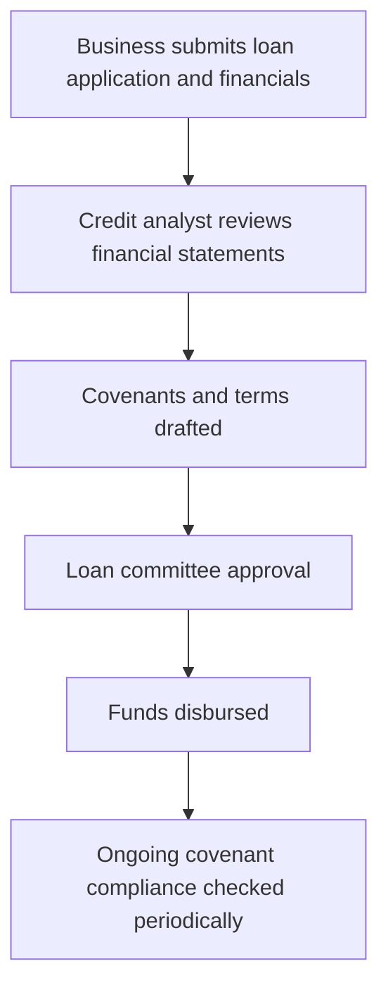
```mermaid
flowchart TD
    A[Business submits loan application and financials] --> B[Credit analyst reviews financial statements]
    B --> C[Covenants and terms drafted]
    C --> D[Loan committee approval]
    D --> E[Funds disbursed]
    E --> F[Ongoing covenant compliance checked periodically]
```
*Pain point: covenant compliance monitoring is often a manual, periodic spreadsheet review rather than continuous.*

#### Cash Management Services
Providing treasury tools like sweep accounts and lockbox processing to business clients. Helps clients optimize working capital.
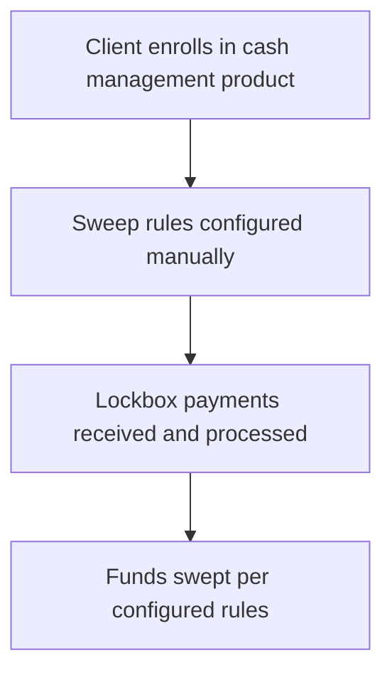
```mermaid
flowchart TD
    A[Client enrolls in cash management product] --> B[Sweep rules configured manually]
    B --> C[Lockbox payments received and processed]
    C --> D[Funds swept per configured rules]
```
*Pain point: initial setup and rule changes usually require a manual configuration request to the bank.*

#### Trade Finance
Issuing letters of credit and documentary collections to support cross-border trade. Also covers supply chain finance and export credit.
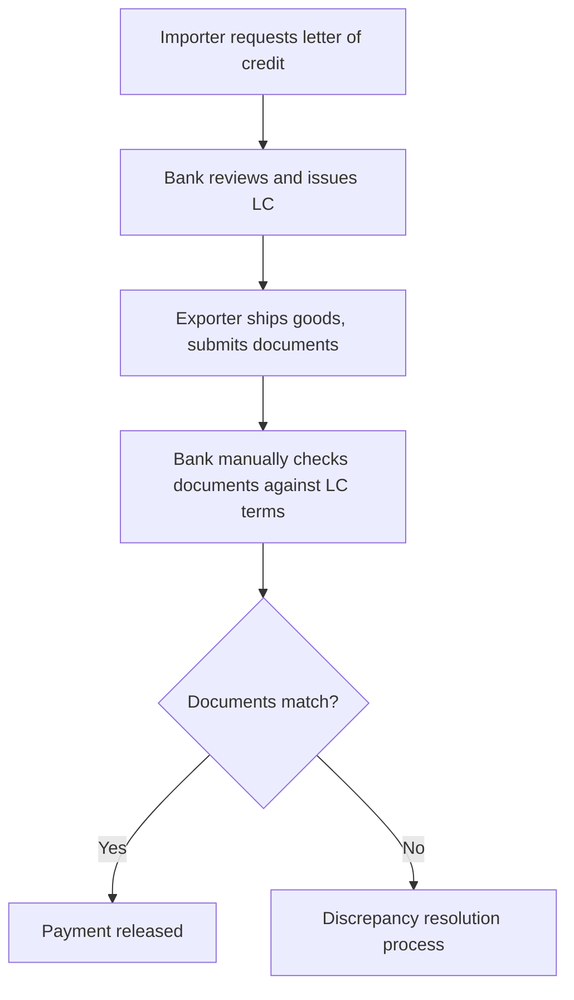
```mermaid
flowchart TD
    A[Importer requests letter of credit] --> B[Bank reviews and issues LC]
    B --> C[Exporter ships goods, submits documents]
    C --> D[Bank manually checks documents against LC terms]
    D --> E{Documents match?}
    E -->|Yes| F[Payment released]
    E -->|No| G[Discrepancy resolution process]
```
*Pain point: manual document matching against LC terms is slow and a common source of trade delays.*

#### Syndicated Lending
Structuring large loans funded jointly by multiple banks. Involves negotiating terms and allocating risk across lenders.
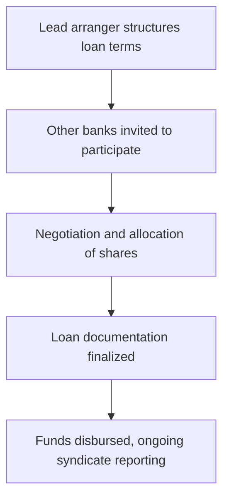
```mermaid
flowchart TD
    A[Lead arranger structures loan terms] --> B[Other banks invited to participate]
    B --> C[Negotiation and allocation of shares]
    C --> D[Loan documentation finalized]
    D --> E[Funds disbursed, ongoing syndicate reporting]
```
*Pain point: coordinating terms and documentation across many participating banks is a slow, manual negotiation process.*

#### Corporate Treasury Services
Managing liquidity and FX/interest-rate hedging for large corporate clients. Includes cash pooling across subsidiaries.
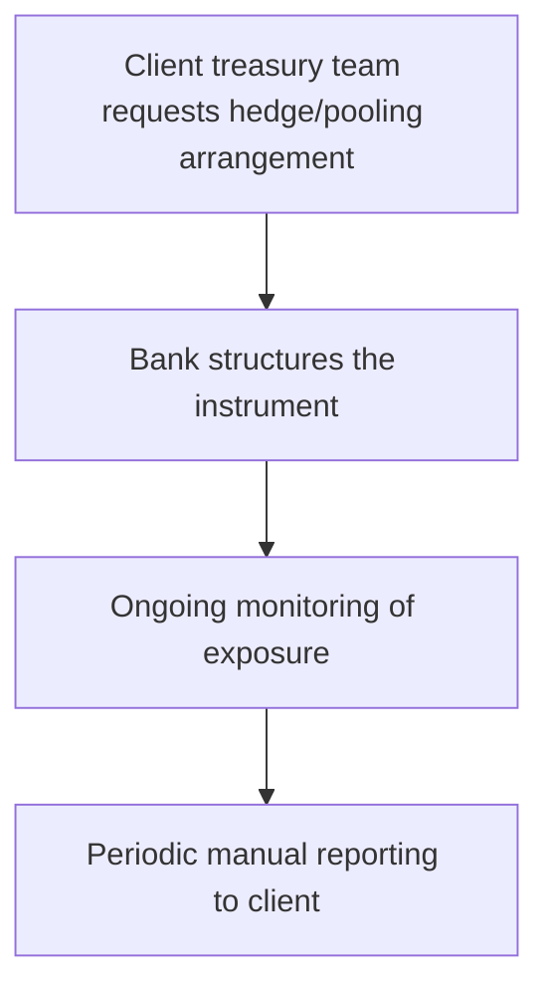
```mermaid
flowchart TD
    A[Client treasury team requests hedge/pooling arrangement] --> B[Bank structures the instrument]
    B --> C[Ongoing monitoring of exposure]
    C --> D[Periodic manual reporting to client]
```
*Pain point: exposure monitoring and reporting is often periodic rather than continuous.*

### Private Banking

#### Relationship Management
Providing dedicated advisory and concierge banking to high-net-worth clients. Coordinates across lending, investing, and daily banking needs.
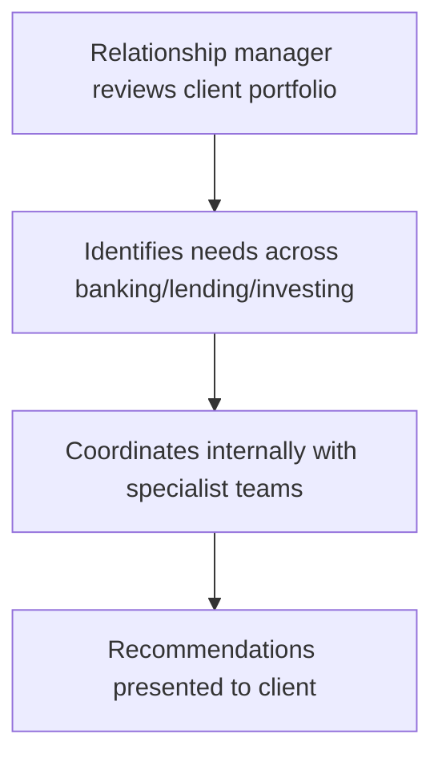
```mermaid
flowchart TD
    A[Relationship manager reviews client portfolio] --> B[Identifies needs across banking/lending/investing]
    B --> C[Coordinates internally with specialist teams]
    C --> D[Recommendations presented to client]
```
*Pain point: coordinating across internal specialist teams for one client is manual and relationship-manager-dependent.*

#### Estate & Trust Services
Structuring wealth transfer plans and administering trusts. Coordinates with legal counsel on succession planning.
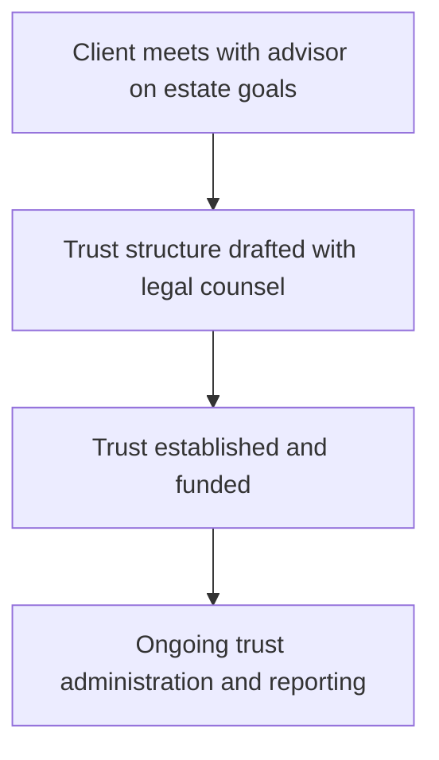
```mermaid
flowchart TD
    A[Client meets with advisor on estate goals] --> B[Trust structure drafted with legal counsel]
    B --> C[Trust established and funded]
    C --> D[Ongoing trust administration and reporting]
```
*Pain point: drafting and coordinating with outside legal counsel is a slow, document-heavy process.*

## Investment Banking & Capital Markets

### M&A Advisory
Identifying acquisition targets and structuring merger or divestiture deals. Includes valuation modeling and negotiation support.
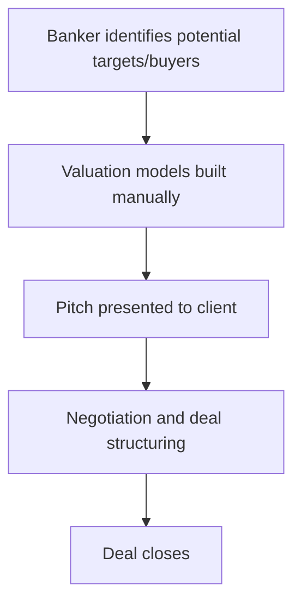
```mermaid
flowchart TD
    A[Banker identifies potential targets/buyers] --> B[Valuation models built manually]
    B --> C[Pitch presented to client]
    C --> D[Negotiation and deal structuring]
    D --> E[Deal closes]
```
*Pain point: valuation modeling is rebuilt largely from scratch for each deal in spreadsheets.*

### Equity Capital Markets
Preparing companies for IPOs, running investor roadshows, and pricing share offerings. Manages the allocation process among institutional buyers.
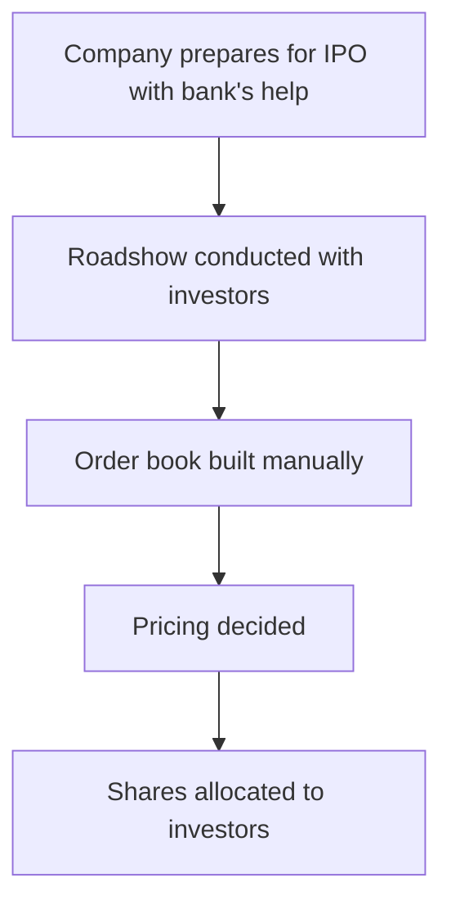
```mermaid
flowchart TD
    A[Company prepares for IPO with bank's help] --> B[Roadshow conducted with investors]
    B --> C[Order book built manually]
    C --> D[Pricing decided]
    D --> E[Shares allocated to investors]
```
*Pain point: building and managing the order book during a roadshow is a manually intensive, time-pressured process.*

### Debt Capital Markets
Structuring bond issuances and coordinating with credit rating agencies. Determines pricing and investor placement for new debt.
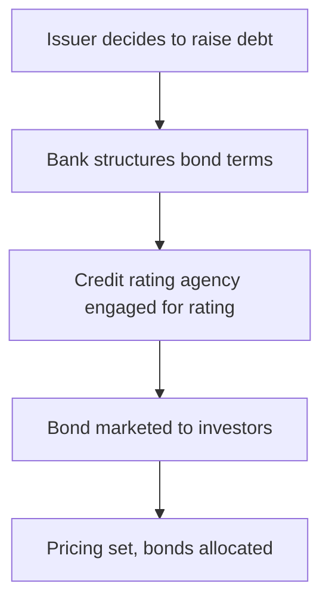
```mermaid
flowchart TD
    A[Issuer decides to raise debt] --> B[Bank structures bond terms]
    B --> C[Credit rating agency engaged for rating]
    C --> D[Bond marketed to investors]
    D --> E[Pricing set, bonds allocated]
```
*Pain point: coordinating timing between rating agency review and investor marketing is a manual scheduling challenge.*

### Sales & Trading
Executing client orders and making markets in equities, fixed income, FX, and derivatives. Includes proprietary trading within risk limits.
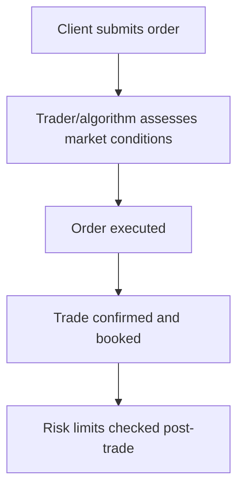
```mermaid
flowchart TD
    A[Client submits order] --> B[Trader/algorithm assesses market conditions]
    B --> C[Order executed]
    C --> D[Trade confirmed and booked]
    D --> E[Risk limits checked post-trade]
```
*Pain point: some risk limit checks still happen post-trade rather than pre-trade, creating exposure windows.*

### Research
Producing equity, credit, and macro research for institutional clients. Publishes ratings and price targets that inform trading decisions.
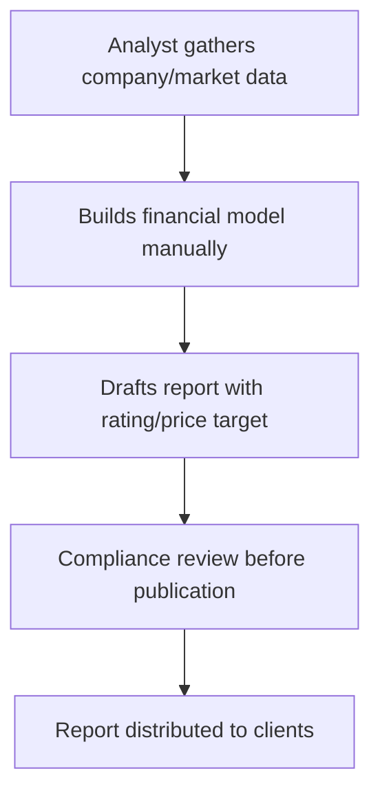
```mermaid
flowchart TD
    A[Analyst gathers company/market data] --> B[Builds financial model manually]
    B --> C[Drafts report with rating/price target]
    C --> D[Compliance review before publication]
    D --> E[Report distributed to clients]
```
*Pain point: financial model updates for each new data point (earnings, guidance) are manually rebuilt.*

### Securities Settlement
Confirming trade details and ensuring securities and cash change hands correctly. Coordinates with clearinghouses and custodians.
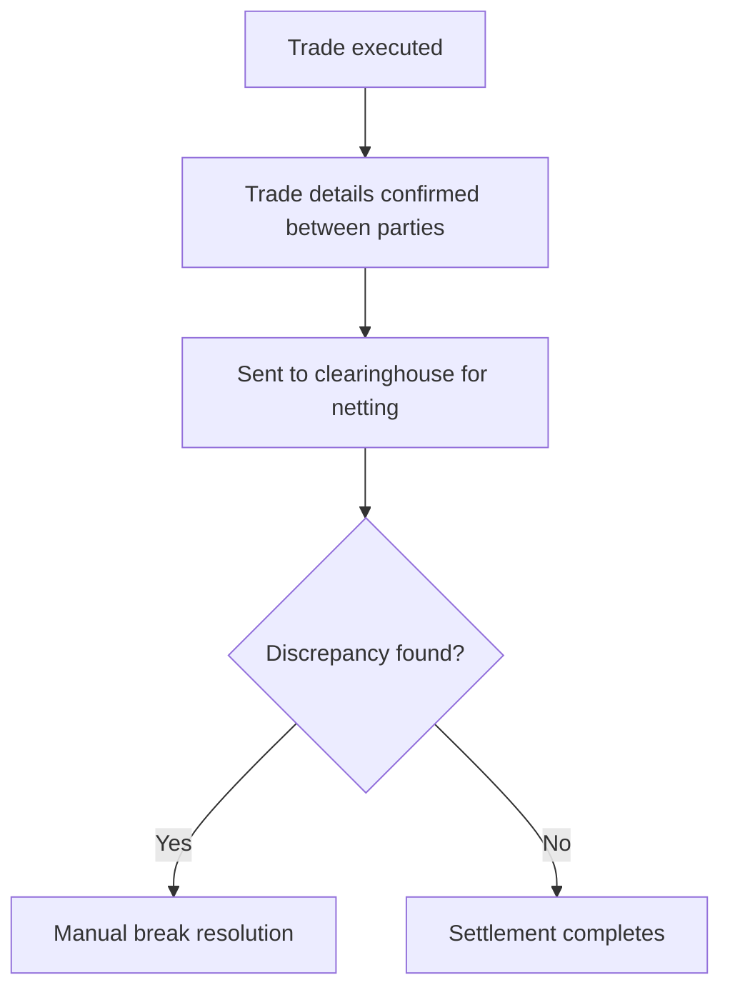
```mermaid
flowchart TD
    A[Trade executed] --> B[Trade details confirmed between parties]
    B --> C[Sent to clearinghouse for netting]
    C --> D{Discrepancy found?}
    D -->|Yes| E[Manual break resolution]
    D -->|No| F[Settlement completes]
```
*Pain point: settlement "breaks" (mismatches) require manual investigation and resolution, often under time pressure.*

## Asset & Wealth Management

### Portfolio Management
Deciding asset allocation and selecting individual securities for client portfolios. Includes ongoing rebalancing against target allocations.
```mermaid
flowchart TD
    A[Portfolio manager reviews target allocation] --> B[Market analysis informs security selection]
    B --> C[Trades placed to rebalance]
    C --> D[Portfolio drift monitored periodically]
```
*Pain point: drift monitoring and rebalancing decisions are often made on a periodic schedule rather than continuously.*

### Fund Administration
Calculating daily net asset value (NAV) and producing investor statements. Ensures accurate accounting across fund structures.
```mermaid
flowchart TD
    A[Daily fund holdings and prices collected] --> B[NAV calculated manually or semi-automated]
    B --> C[Reconciled against custodian records]
    C --> D[Investor statements generated]
```
*Pain point: reconciling NAV calculations against custodian records daily is a manual, error-prone checkpoint.*

### Custody & Fund Services
Safekeeping client assets and handling transfer agency functions like unit registration. Supports settlement of fund purchases and redemptions.
```mermaid
flowchart TD
    A[Investor submits purchase/redemption request] --> B[Transfer agent processes request manually]
    B --> C[Units registered/deregistered]
    C --> D[Custodian updates asset records]
```
*Pain point: transfer agency processing still relies heavily on manual paperwork for many fund types.*

### Alternative Investments
Allocating client capital to private equity, hedge funds, and real assets. Requires specialized due diligence beyond public markets.
```mermaid
flowchart TD
    A[Advisor evaluates alternative fund opportunities] --> B[Extensive manual due diligence conducted]
    B --> C[Investment committee approval]
    C --> D[Capital committed to the fund]
```
*Pain point: due diligence on illiquid, opaque alternative investments is time-intensive and document-heavy.*

### Robo-Advisory
Delivering algorithm-driven, low-cost portfolio management with minimal human advisor involvement. Rebalances automatically based on a client's risk profile.
```mermaid
flowchart TD
    A[Client completes risk questionnaire] --> B[Algorithm assigns model portfolio]
    B --> C[Portfolio automatically rebalanced periodically]
    C --> D[Client can escalate to human advisor if needed]
```
*Pain point: edge cases (unusual client circumstances) still require escalation to a human, breaking the automated flow.*

### Client Onboarding & Advisory
Profiling client risk tolerance and building a financial plan. Sets the investment policy that guides ongoing portfolio decisions.
```mermaid
flowchart TD
    A[Advisor meets with client] --> B[Risk tolerance and goals assessed manually]
    B --> C[Financial plan drafted]
    C --> D[Investment policy statement created]
```
*Pain point: building a financial plan is a manual, advisor-time-intensive process for each client.*

### Compliance & Reporting
Filing required regulatory disclosures such as Form ADV. Maintains records demonstrating adherence to fiduciary standards.
```mermaid
flowchart TD
    A[Compliance team gathers required disclosure data] --> B[Filing drafted manually]
    B --> C[Internal review and sign-off]
    C --> D[Filed with regulator]
```
*Pain point: gathering data from multiple internal systems for each filing is manual and time-consuming.*

### Performance Attribution
Breaking down portfolio returns into the specific decisions that drove them. Helps distinguish skill from market movement.
```mermaid
flowchart TD
    A[Portfolio returns pulled for period] --> B[Analyst decomposes returns by factor/decision]
    B --> C[Attribution report drafted]
    C --> D[Reviewed with portfolio manager]
```
*Pain point: attribution analysis is often done after the fact in spreadsheets, not integrated into daily decision-making.*

## Insurance

### Underwriting
Assessing risk on a proposed policy and setting its price. Decides whether to accept, decline, or modify coverage terms.
```mermaid
flowchart TD
    A[Applicant submits information] --> B[Underwriter reviews risk factors]
    B --> C{Standard risk?}
    C -->|Yes| D[Policy priced and issued]
    C -->|No| E[Manual review, possible additional underwriting]
```
*Pain point: non-standard risk cases require significant manual underwriter judgment and back-and-forth for more information.*

### Claims Processing
Handling a policyholder's loss from first notice through investigation to settlement. Determines payout amount based on policy terms.
```mermaid
flowchart TD
    A[Policyholder reports loss - FNOL] --> B[Claims adjuster assigned]
    B --> C[Investigation conducted, documents gathered]
    C --> D[Payout amount determined against policy terms]
    D --> E[Settlement issued]
```
*Pain point: investigation and document gathering is manual and often the slowest part of the claims cycle.*

### Policy Administration
Managing renewals, mid-term endorsements, and cancellations. Keeps policy records accurate throughout the coverage period.
```mermaid
flowchart TD
    A[Policyholder requests change or renewal approaches] --> B[Administrator manually updates policy record]
    B --> C[Premium recalculated if needed]
    C --> D[Updated documents issued to policyholder]
```
*Pain point: mid-term endorsement processing often requires manual recalculation and reissuance of documents.*

### Actuarial
Calculating reserves needed to cover future claims and building pricing models. Underpins both underwriting and financial reporting.
```mermaid
flowchart TD
    A[Historical claims data gathered] --> B[Actuary builds reserve/pricing models]
    B --> C[Models reviewed and validated]
    C --> D[Results feed underwriting and financial reporting]
```
*Pain point: model updates as new claims data arrives are periodic, not continuous.*

### Reinsurance
Ceding risk to other insurers to limit exposure, or assuming risk from others. Spreads catastrophic risk across the broader insurance market.
```mermaid
flowchart TD
    A[Insurer identifies risk exposure to cede] --> B[Reinsurance treaty negotiated]
    B --> C[Risk ceded per treaty terms]
    C --> D[Claims shared per agreement when triggered]
```
*Pain point: treaty negotiation and claims-sharing calculations are manual and document-intensive.*

### Distribution & Broker Management
Onboarding agents and brokers and managing their commission structures. Oversees the sales channel that brings in new policies.
```mermaid
flowchart TD
    A[Broker applies to sell insurer's products] --> B[Manual licensing/compliance verification]
    B --> C[Broker onboarded, commission structure set]
    C --> D[Ongoing commission tracking and payment]
```
*Pain point: verifying broker licensing across multiple states/regions is a manual compliance check.*

## Payments & Fintech

### Payment Authorization & Settlement
Approving a transaction in real time and moving funds between accounts. Involves multiple intermediaries clearing in the background.
```mermaid
flowchart TD
    A[Transaction initiated] --> B[Authorization request sent through network]
    B --> C{Approved?}
    C -->|Yes| D[Funds move between accounts]
    C -->|No| E[Transaction declined]
    D --> F[Settlement finalized in batch later]
```
*Pain point: final settlement often happens in batch cycles well after the "instant" approval the customer sees.*

### Card Issuing & Acquiring
Issuing payment cards on behalf of banks and onboarding merchants to accept them. Sits on both sides of a card transaction.
```mermaid
flowchart TD
    A[Bank partners with issuer processor] --> B[Cards issued to customers]
    B --> C[Merchant applies to accept cards]
    C --> D[Merchant underwritten and onboarded]
```
*Pain point: merchant underwriting for risk (especially small/new merchants) is a manual review process.*

### Digital Wallets & Stored Value
Managing app-based accounts that hold funds for spending or transfer. Includes linking bank accounts and cards to the wallet.
```mermaid
flowchart TD
    A[User creates wallet account] --> B[Links bank account or card]
    B --> C[Funds loaded or received]
    C --> D[User spends or transfers from wallet balance]
```
*Pain point: linking and verifying external bank accounts still often requires manual micro-deposit verification.*

### Buy Now, Pay Later Processing
Underwriting short-term installment purchases at checkout. Manages repayment scheduling and delinquency.
```mermaid
flowchart TD
    A[Customer selects BNPL at checkout] --> B[Instant underwriting decision made]
    B --> C{Approved?}
    C -->|Yes| D[Installment schedule set]
    C -->|No| E[Declined, alternative payment offered]
    D --> F{Payment missed?}
    F -->|Yes| G[Delinquency workflow triggered]
```
*Pain point: delinquency handling at scale (many small missed payments) still needs manual escalation paths.*

### Fraud Detection & Prevention
Monitoring transactions in real time for suspicious patterns. Balances blocking fraud against not disrupting legitimate purchases.
```mermaid
flowchart TD
    A[Transaction scored by fraud model] --> B{Score above threshold?}
    B -->|Yes| C[Transaction held or declined]
    B -->|No| D[Transaction proceeds]
    C --> E[Analyst manually reviews flagged case]
```
*Pain point: manual review of flagged transactions creates delay and can wrongly block legitimate customers.*

### Cross-Border Remittance Processing
Converting currency and moving funds internationally for individuals. Requires compliance checks specific to each corridor.
```mermaid
flowchart TD
    A[Sender initiates transfer] --> B[Compliance screening for corridor-specific rules]
    B --> C[Currency converted]
    C --> D[Funds routed through correspondent network]
    D --> E[Recipient receives funds]
```
*Pain point: routing through multiple correspondent banks in some corridors adds delay and manual reconciliation.*

## Financial Market Infrastructure

### Exchange Operations
Running the matching engine that pairs buy and sell orders. Also distributes real-time market data to participants.
```mermaid
flowchart TD
    A[Orders submitted by market participants] --> B[Matching engine pairs buy/sell orders]
    B --> C[Trade executed]
    C --> D[Market data disseminated to participants]
```
*Pain point: while matching itself is automated, exception handling for erroneous trades still requires manual intervention.*

### Clearing & Settlement
Guaranteeing that trades complete even if one party defaults. Nets offsetting positions to reduce settlement volume.
```mermaid
flowchart TD
    A[Trade sent to clearinghouse] --> B[Positions netted across participants]
    B --> C[Margin requirements calculated]
    C --> D[Settlement instructions issued]
```
*Pain point: margin calls during volatile periods can require manual coordination with participants under time pressure.*

### Custody & Depository Services
Holding securities electronically on behalf of institutional owners. Supports the final leg of trade settlement.
```mermaid
flowchart TD
    A[Securities registered in depository] --> B[Ownership records updated on trade settlement]
    B --> C[Corporate actions (dividends, splits) processed]
```
*Pain point: corporate action processing across many issuers is still manually intensive to track and apply correctly.*

## Private Equity & Venture Capital

### Fundraising
Raising committed capital from institutional and high-net-worth investors. Involves ongoing investor relations throughout the fund's life.
```mermaid
flowchart TD
    A[Fund manager creates pitch materials] --> B[Investor meetings conducted]
    B --> C[Due diligence by investors]
    C --> D[Capital commitments signed]
```
*Pain point: responding to each investor's due diligence questionnaire is a largely manual, repetitive process.*

### Deal Sourcing & Due Diligence
Identifying acquisition targets and evaluating their financial, legal, and commercial health. Determines whether and at what price to invest.
```mermaid
flowchart TD
    A[Deal team identifies target company] --> B[Financial, legal, commercial diligence conducted]
    B --> C[Investment committee review]
    C --> D{Approved?}
    D -->|Yes| E[Deal negotiated and closed]
    D -->|No| F[Deal passed on]
```
*Pain point: diligence involves manually reviewing large volumes of financial and legal documents.*

### Portfolio Company Management
Working with portfolio companies to improve operations and governance. Often includes board seats and operating-partner involvement.
```mermaid
flowchart TD
    A[Operating partner reviews portfolio company performance] --> B[Improvement initiatives identified]
    B --> C[Board oversight and governance support provided]
    C --> D[Performance tracked periodically]
```
*Pain point: performance tracking across a portfolio of companies is often manual and inconsistent between companies.*

### Exit Planning
Preparing a portfolio company for sale, IPO, or recapitalization. Times the exit to maximize investor returns.
```mermaid
flowchart TD
    A[Fund evaluates exit readiness and market conditions] --> B[Exit process chosen: sale, IPO, recap]
    B --> C[Advisors engaged, process run]
    C --> D[Exit completed, proceeds distributed]
```
*Pain point: preparing the extensive documentation needed for an exit process is manual and time-consuming.*

## Corporate Finance / Financial Operations

### Accounts Payable
Invoice receipt, 3-way matching, approval routing, payment execution, vendor management.
```mermaid
flowchart TD
    A[Invoice received from vendor] --> B[3-way match: PO, receipt, invoice]
    B --> C{Match successful?}
    C -->|Yes| D[Routed for approval]
    C -->|No| E[Exception investigated manually]
    D --> F[Payment executed]
```
*Pain point: matching exceptions require someone to manually trace back through PO and receiving records.*

### Accounts Receivable
Invoicing, collections, cash application, dispute resolution.
```mermaid
flowchart TD
    A[Invoice issued to customer] --> B[Payment received]
    B --> C[Cash application: match payment to invoice]
    C --> D{Match found?}
    D -->|Yes| E[Invoice closed]
    D -->|No| F[Manual investigation/dispute resolution]
```
*Pain point: unmatched payments require manual research to identify which invoice they belong to.*

### Financial Close & Reporting
Month-end close, journal entries, consolidation, external reporting.
```mermaid
flowchart TD
    A[Sub-ledgers closed for the period] --> B[Journal entries prepared and reviewed]
    B --> C[Accounts reconciled]
    C --> D[Consolidation across entities]
    D --> E[External report finalized]
```
*Pain point: reconciliation across many accounts and entities is manual and is usually the close's biggest bottleneck.*

### FP&A
Budgeting, forecasting, variance analysis, board reporting.
```mermaid
flowchart TD
    A[Prior actuals and assumptions gathered] --> B[Budget/forecast built in spreadsheets]
    B --> C[Actuals compared to forecast]
    C --> D[Variance explanations gathered from department heads]
    D --> E[Board report compiled]
```
*Pain point: chasing department heads for variance explanations each cycle is manual and slow.*

### Treasury
Cash positioning, liquidity forecasting, bank relationship management, FX/interest-rate hedging.
```mermaid
flowchart TD
    A[Cash balances pulled from multiple bank accounts] --> B[Position consolidated manually]
    B --> C[Liquidity forecast built]
    C --> D[Hedging decisions made if needed]
```
*Pain point: consolidating cash positions across many bank accounts/entities is a manual daily task.*

### Payroll
Time & attendance, payroll processing, tax withholding, benefits administration.
```mermaid
flowchart TD
    A[Time & attendance data collected] --> B[Exceptions reviewed manually]
    B --> C[Payroll calculated: wages, tax withholding, benefits]
    C --> D[Payroll approved and disbursed]
```
*Pain point: time & attendance exceptions (missed clock-ins, overtime disputes) require manual review each cycle.*

### Procurement
Vendor sourcing, purchase order management, contract management.
```mermaid
flowchart TD
    A[Need identified, vendor sourced] --> B[Purchase order created]
    B --> C[Approval routing based on amount]
    C --> D[PO sent to vendor]
    D --> E[Contract terms tracked for renewal]
```
*Pain point: contract renewal dates tracked manually are often missed, leading to unfavorable auto-renewals.*

### Tax
Compliance filing, tax provision, transfer pricing.
```mermaid
flowchart TD
    A[Financial data gathered for tax period] --> B[Tax provision calculated]
    B --> C[Returns prepared and reviewed]
    C --> D[Filed with tax authorities]
```
*Pain point: gathering data across international entities for transfer pricing documentation is a manual, time-intensive process.*

### Internal Audit & Controls
SOX compliance, control testing.
```mermaid
flowchart TD
    A[Audit plan defines controls to test] --> B[Auditor samples transactions manually]
    B --> C[Control gaps identified]
    C --> D[Remediation plan tracked]
```
*Pain point: manual sampling means many transactions are never actually tested.*

## Regulatory & Compliance

### AML/KYC
Customer due diligence, transaction monitoring, suspicious activity reporting.
```mermaid
flowchart TD
    A[Customer transactions monitored against rules] --> B{Suspicious pattern flagged?}
    B -->|Yes| C[Analyst manually investigates]
    B -->|No| D[No action]
    C --> E{Confirmed suspicious?}
    E -->|Yes| F[Suspicious Activity Report filed]
```
*Pain point: rules-based monitoring generates many false positives that still require manual analyst review.*

### Sanctions Screening
OFAC/watchlist screening on transactions and customers.
```mermaid
flowchart TD
    A[Customer/transaction screened against watchlists] --> B{Name match found?}
    B -->|Yes| C[Manual review to confirm true match]
    B -->|No| D[Transaction proceeds]
    C --> E{Confirmed?}
    E -->|Yes| F[Transaction blocked, reported]
    E -->|No| G[False positive cleared]
```
*Pain point: name-matching produces many false positives (common names) requiring manual clearing.*

### Risk Management
Credit risk, market risk, operational risk modeling.
```mermaid
flowchart TD
    A[Risk data gathered across business lines] --> B[Models calculate exposure]
    B --> C[Results reviewed by risk committee]
    C --> D[Limits set or adjusted]
```
*Pain point: aggregating risk data across siloed business-line systems is a manual data-gathering exercise.*

### Capital Adequacy & Stress Testing
Regulatory capital calculation, scenario analysis.
```mermaid
flowchart TD
    A[Balance sheet data gathered] --> B[Stress scenarios applied]
    B --> C[Capital ratios calculated under each scenario]
    C --> D[Results submitted to regulator]
```
*Pain point: running and validating multiple stress scenarios is a manual, time-intensive quarterly exercise.*

### Consumer Protection Compliance
Fair lending, UDAAP, disclosure requirements.
```mermaid
flowchart TD
    A[Lending decisions and disclosures reviewed] --> B[Compliance team samples files]
    B --> C{Issue found?}
    C -->|Yes| D[Remediation required]
    C -->|No| E[File cleared]
```
*Pain point: sampling-based file review means most files are never individually checked for compliance.*

### Regulatory Reporting
Basel III, Dodd-Frank, call reports.
```mermaid
flowchart TD
    A[Data gathered from multiple internal systems] --> B[Report template populated manually]
    B --> C[Internal review and sign-off]
    C --> D[Filed with regulator]
```
*Pain point: reconciling data from multiple source systems into one report template is manual and error-prone.*

## Credit Rating Agencies

### Credit Assessment
Evaluating the creditworthiness of a bond issuer or specific debt instrument.
```mermaid
flowchart TD
    A[Issuer provides financial data] --> B[Analyst builds credit model]
    B --> C[Rating committee reviews and votes]
    C --> D[Rating assigned]
```
*Pain point: the rating committee process relies on manual presentation and discussion of each case.*

### Rating Issuance & Surveillance
Publishing and ongoing monitoring of ratings.
```mermaid
flowchart TD
    A[Rating published] --> B[Analyst monitors issuer performance periodically]
    B --> C{Material change detected?}
    C -->|Yes| D[Rating review triggered]
    C -->|No| E[Rating maintained]
```
*Pain point: surveillance is periodic, so a rating can lag a real deterioration in credit quality.*

## Central Banking / Monetary Authorities

### Monetary Policy Setting
Interest rate decisions, policy communication.
```mermaid
flowchart TD
    A[Economic data gathered and analyzed] --> B[Policy committee deliberates]
    B --> C[Rate decision made]
    C --> D[Decision communicated to markets]
```
*Pain point: synthesizing diverse economic indicators into one coherent policy view is a manual analytical process.*

### Open Market Operations
Managing money supply through securities transactions.
```mermaid
flowchart TD
    A[Desk assesses liquidity conditions] --> B[Securities bought or sold in the market]
    B --> C[Impact on money supply monitored]
```
*Pain point: assessing real-time liquidity conditions still relies on analyst judgment layered on incomplete data.*

### Currency Issuance
Physical and digital currency management.
```mermaid
flowchart TD
    A[Currency demand forecasted] --> B[Production/minting ordered]
    B --> C[Currency distributed to banks]
    C --> D[Worn currency withdrawn and destroyed]
```
*Pain point: forecasting physical currency demand by denomination and region is imprecise and manual.*

### Bank Supervision
Regulating and examining financial institutions.
```mermaid
flowchart TD
    A[Examination scheduled for institution] --> B[Examiners review records on-site/remotely]
    B --> C[Findings documented]
    C --> D[Institution required to remediate issues]
```
*Pain point: on-site/document-based examination is time-intensive and only samples a subset of activity.*

## Microfinance / Financial Inclusion

### Micro-Lending
Small-loan origination and servicing for underserved populations.
```mermaid
flowchart TD
    A[Borrower applies, often in person] --> B[Field officer assesses creditworthiness manually]
    B --> C[Loan approved and disbursed]
    C --> D[Field officer collects repayments in person]
```
*Pain point: in-person credit assessment and repayment collection is labor-intensive and limits scale.*

### Group Lending Models
Joint-liability lending structures.
```mermaid
flowchart TD
    A[Borrower group formed] --> B[Group jointly guarantees loans]
    B --> C[Loans disbursed to members]
    C --> D[Group meets regularly to collect repayments]
```
*Pain point: organizing and tracking group meetings and joint liability is manual and relationship-dependent.*

### Financial Literacy Programs
Client education and capability building.
```mermaid
flowchart TD
    A[Program curriculum developed] --> B[In-person or group training sessions held]
    B --> C[Client understanding assessed informally]
```
*Pain point: measuring whether training actually changes client financial behavior is rarely done rigorously.*
