# Life Sciences Sector — Full Breakdown with Traditional Process Flows

Each sub-function below includes: a two-line description, a Mermaid flowchart of how the process traditionally runs today, and the main pain point in that traditional flow.

## Pharmaceuticals — full pipeline, discovery through commercialization

### Drug Discovery
Identifying biological targets and screening candidate compounds against them. Narrows thousands of candidates down to a handful worth developing further.
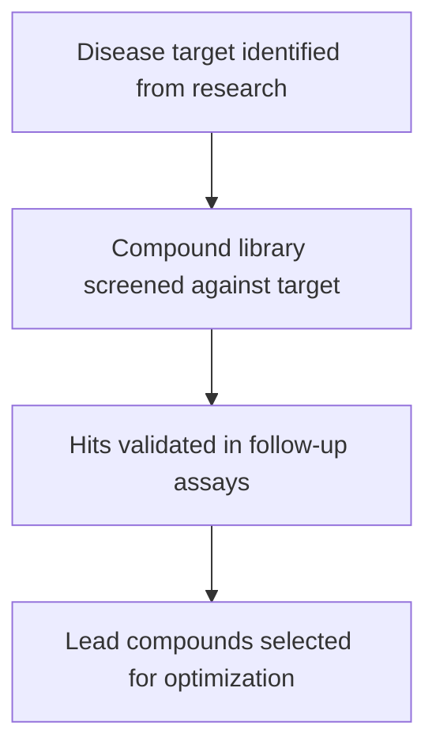
```mermaid
flowchart TD
    A[Disease target identified from research] --> B[Compound library screened against target]
    B --> C[Hits validated in follow-up assays]
    C --> D[Lead compounds selected for optimization]
```
*Pain point: screening and validating thousands of compounds manually/semi-manually is slow and resource-intensive.*

### Preclinical Development
Running toxicology and animal studies before human testing. Establishes a safety baseline required to start clinical trials.
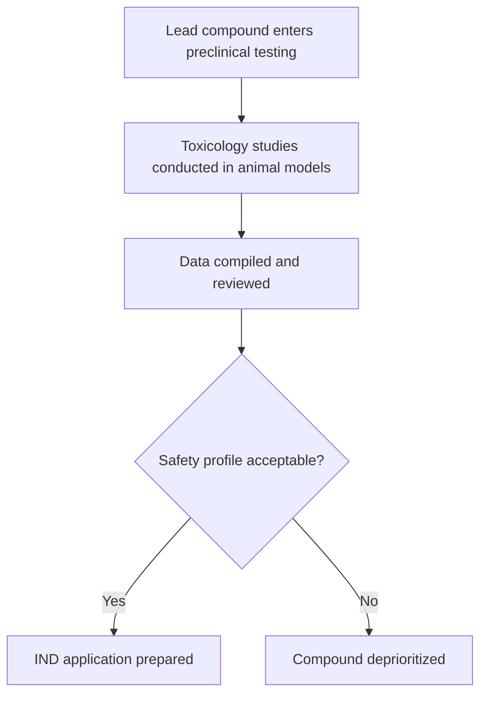
```mermaid
flowchart TD
    A[Lead compound enters preclinical testing] --> B[Toxicology studies conducted in animal models]
    B --> C[Data compiled and reviewed]
    C --> D{Safety profile acceptable?}
    D -->|Yes| E[IND application prepared]
    D -->|No| F[Compound deprioritized]
```
*Pain point: compiling and reviewing study data across multiple labs/CROs is a manual, document-heavy process.*

### Clinical Trials (Phase I–IV)
Trial design, patient recruitment, data collection, monitoring.
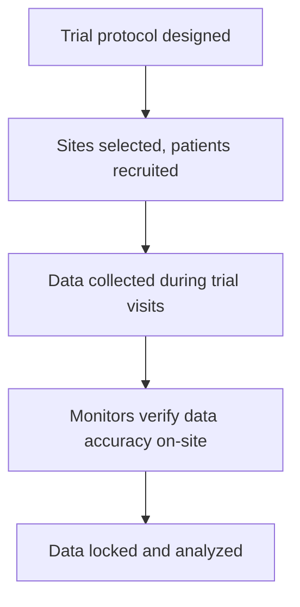
```mermaid
flowchart TD
    A[Trial protocol designed] --> B[Sites selected, patients recruited]
    B --> C[Data collected during trial visits]
    C --> D[Monitors verify data accuracy on-site]
    D --> E[Data locked and analyzed]
```
*Pain point: patient recruitment is often the single biggest bottleneck, relying on manual outreach by site staff.*

### Regulatory Submission
NDA/BLA filing, FDA interactions.
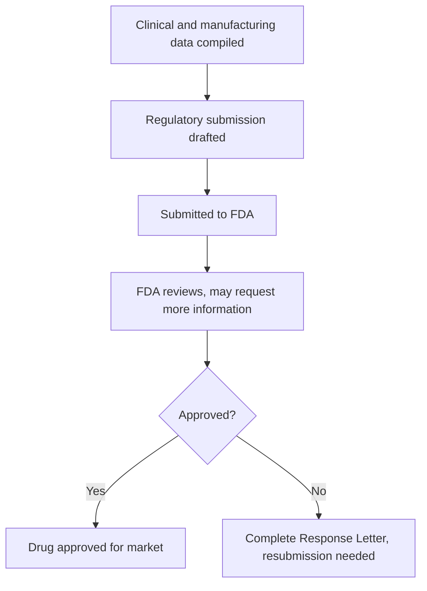
```mermaid
flowchart TD
    A[Clinical and manufacturing data compiled] --> B[Regulatory submission drafted]
    B --> C[Submitted to FDA]
    C --> D[FDA reviews, may request more information]
    D --> E{Approved?}
    E -->|Yes| F[Drug approved for market]
    E -->|No| G[Complete Response Letter, resubmission needed]
```
*Pain point: compiling the massive submission dossier across many contributing teams is a manual coordination effort.*

### Manufacturing & Quality
GMP production, quality control/assurance, batch release.
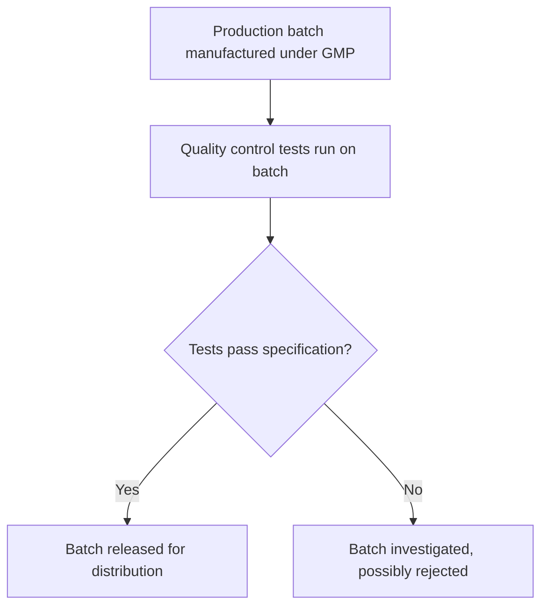
```mermaid
flowchart TD
    A[Production batch manufactured under GMP] --> B[Quality control tests run on batch]
    B --> C{Tests pass specification?}
    C -->|Yes| D[Batch released for distribution]
    C -->|No| E[Batch investigated, possibly rejected]
```
*Pain point: out-of-specification investigations are manual and can delay batch release significantly.*

### Commercial Launch
Market access strategy, pricing/reimbursement, HCP engagement.
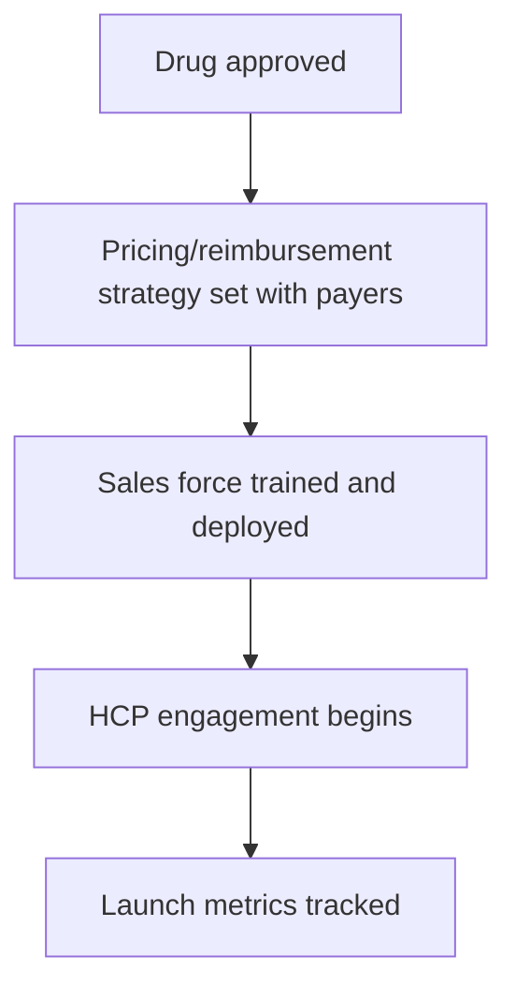
```mermaid
flowchart TD
    A[Drug approved] --> B[Pricing/reimbursement strategy set with payers]
    B --> C[Sales force trained and deployed]
    C --> D[HCP engagement begins]
    D --> E[Launch metrics tracked]
```
*Pain point: negotiating payer coverage one contract at a time is slow and delays patient access after approval.*

## Biotechnology

### Genetic Engineering / Bioprocessing
Cell line development, fermentation.
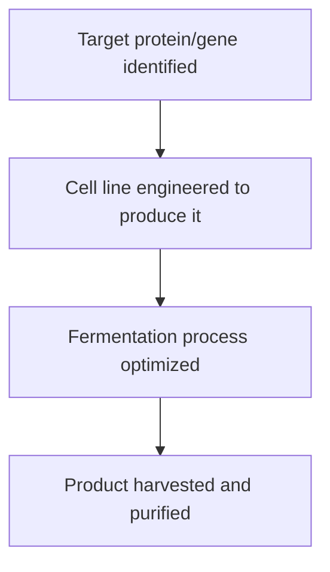
```mermaid
flowchart TD
    A[Target protein/gene identified] --> B[Cell line engineered to produce it]
    B --> C[Fermentation process optimized]
    C --> D[Product harvested and purified]
```
*Pain point: optimizing fermentation conditions is an iterative, manual trial-and-error process.*

### Gene & Cell Therapy Development
Vector design, therapy manufacturing.
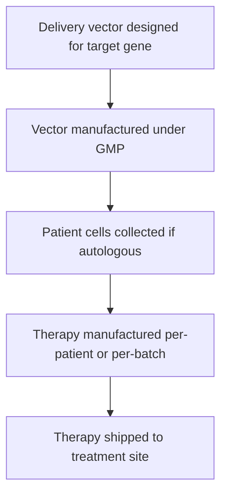
```mermaid
flowchart TD
    A[Delivery vector designed for target gene] --> B[Vector manufactured under GMP]
    B --> C[Patient cells collected if autologous]
    C --> D[Therapy manufactured per-patient or per-batch]
    D --> E[Therapy shipped to treatment site]
```
*Pain point: per-patient manufacturing (autologous therapies) is manually coordinated and logistically complex.*

## Genomics & Precision Medicine

### Genomic Sequencing
DNA/RNA sequencing and analysis.
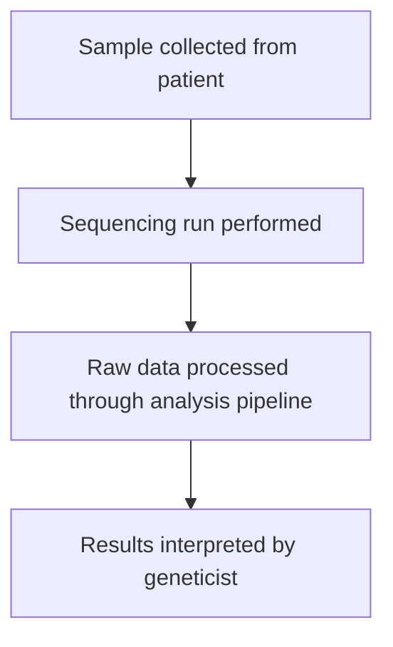
```mermaid
flowchart TD
    A[Sample collected from patient] --> B[Sequencing run performed]
    B --> C[Raw data processed through analysis pipeline]
    C --> D[Results interpreted by geneticist]
```
*Pain point: interpreting raw sequencing output into clinically meaningful findings still requires significant manual expert review.*

### Bioinformatics
Applying computational methods to interpret large-scale genomic and biological data.
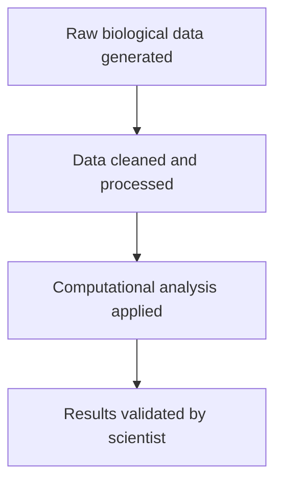
```mermaid
flowchart TD
    A[Raw biological data generated] --> B[Data cleaned and processed]
    B --> C[Computational analysis applied]
    C --> D[Results validated by scientist]
```
*Pain point: validating computational findings against biological plausibility still requires expert manual review.*

### Biomarker Discovery
Identifying measurable indicators linked to disease presence or treatment response.
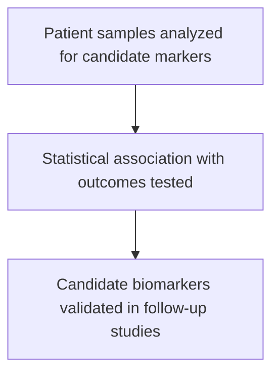
```mermaid
flowchart TD
    A[Patient samples analyzed for candidate markers] --> B[Statistical association with outcomes tested]
    B --> C[Candidate biomarkers validated in follow-up studies]
```
*Pain point: validating a candidate biomarker across independent patient cohorts takes years of manual study coordination.*

### Personalized Treatment Design
Matching a specific therapy to a patient's genetic or molecular profile.
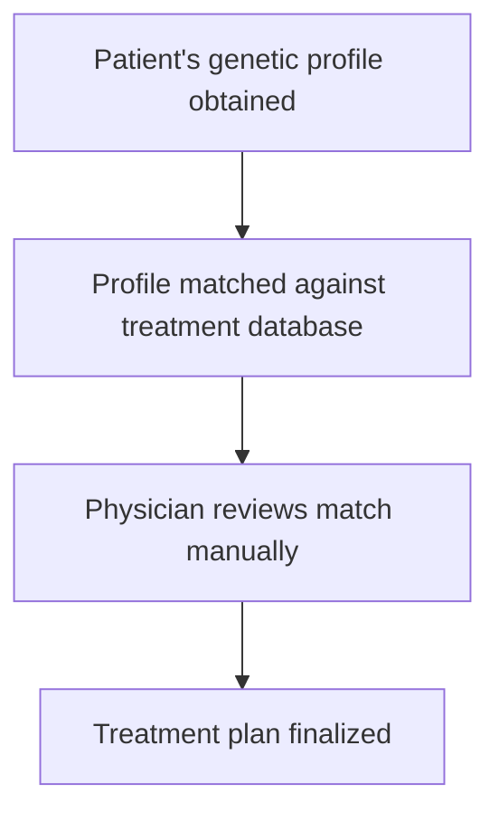
```mermaid
flowchart TD
    A[Patient's genetic profile obtained] --> B[Profile matched against treatment database]
    B --> C[Physician reviews match manually]
    C --> D[Treatment plan finalized]
```
*Pain point: matching a profile to the right treatment relies on physician expertise interpreting complex data.*

## Medical Devices

### Device Design & Engineering
Prototyping devices and testing usability with real users.
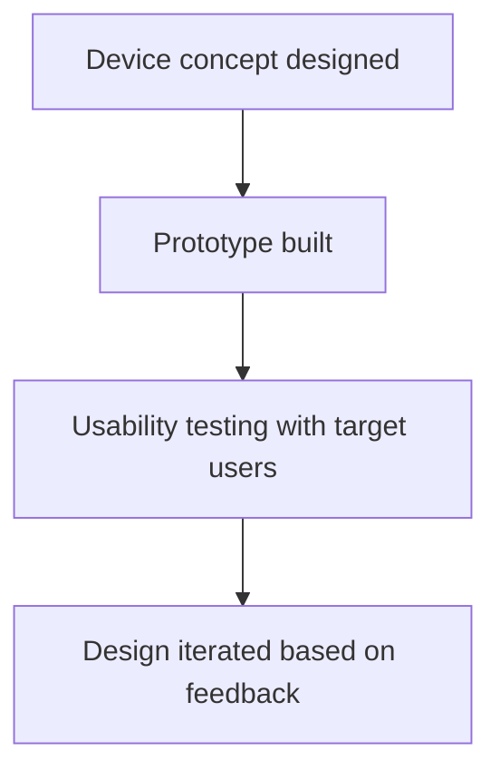
```mermaid
flowchart TD
    A[Device concept designed] --> B[Prototype built]
    B --> C[Usability testing with target users]
    C --> D[Design iterated based on feedback]
```
*Pain point: each design iteration cycle (prototype, test, revise) is manual and time-consuming.*

### Regulatory Clearance
510(k) or PMA submissions depending on device risk classification.
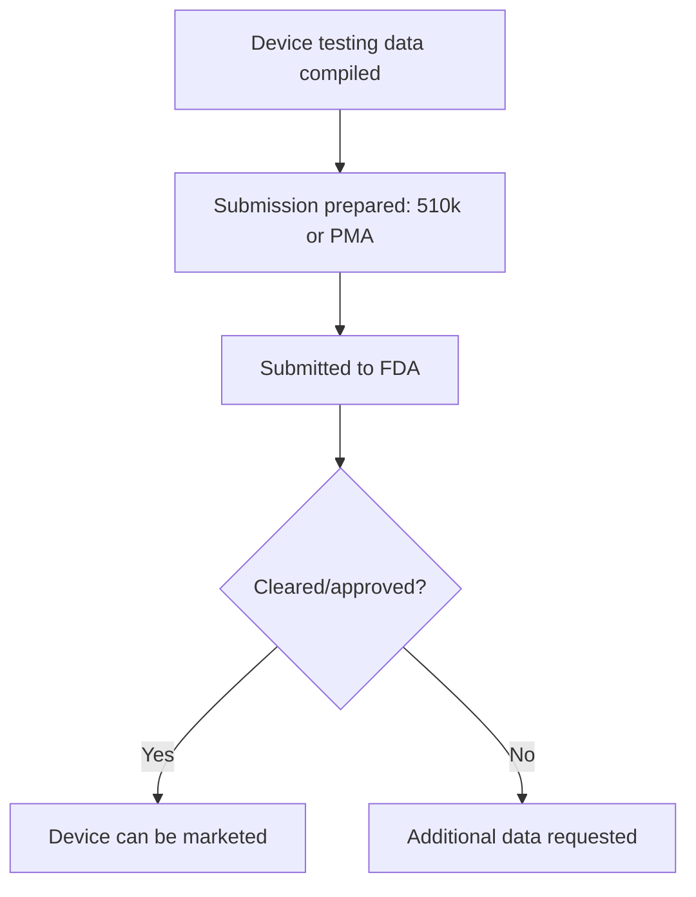
```mermaid
flowchart TD
    A[Device testing data compiled] --> B[Submission prepared: 510k or PMA]
    B --> C[Submitted to FDA]
    C --> D{Cleared/approved?}
    D -->|Yes| E[Device can be marketed]
    D -->|No| F[Additional data requested]
```
*Pain point: compiling the technical file for submission draws from many engineering and testing teams manually.*

### Post-Market Surveillance *(Healthcare)*
Monitoring real-world adverse events and managing recalls if needed.
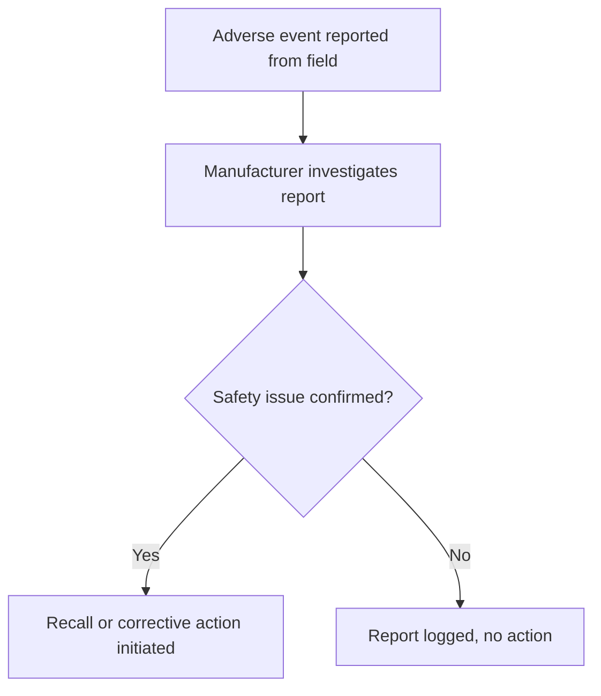
```mermaid
flowchart TD
    A[Adverse event reported from field] --> B[Manufacturer investigates report]
    B --> C{Safety issue confirmed?}
    C -->|Yes| D[Recall or corrective action initiated]
    C -->|No| E[Report logged, no action]
```
*Pain point: investigating individual adverse event reports is manual, and spotting a pattern across many reports takes time.*

## Diagnostics

### Assay Development
Test design and validation.
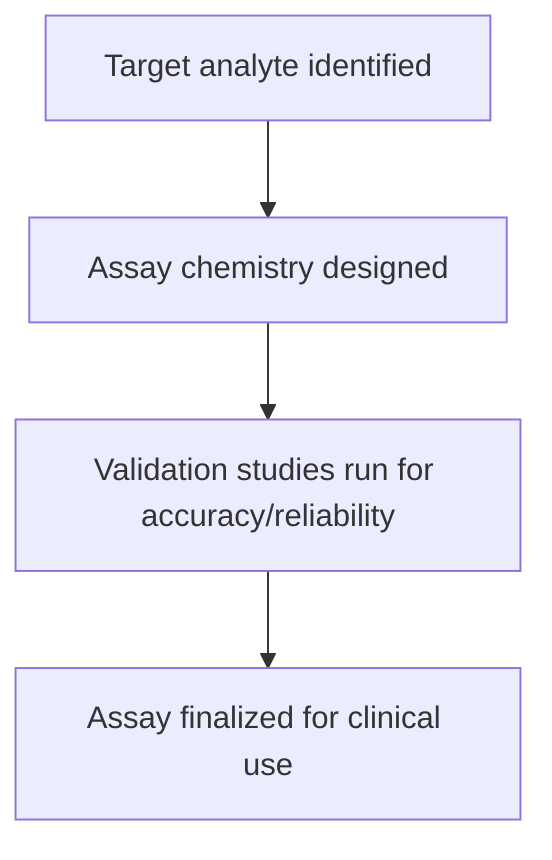
```mermaid
flowchart TD
    A[Target analyte identified] --> B[Assay chemistry designed]
    B --> C[Validation studies run for accuracy/reliability]
    C --> D[Assay finalized for clinical use]
```
*Pain point: validation studies require manually processing many samples to establish statistical confidence.*

### Lab Operations *(Healthcare)*
Sample processing, result reporting.
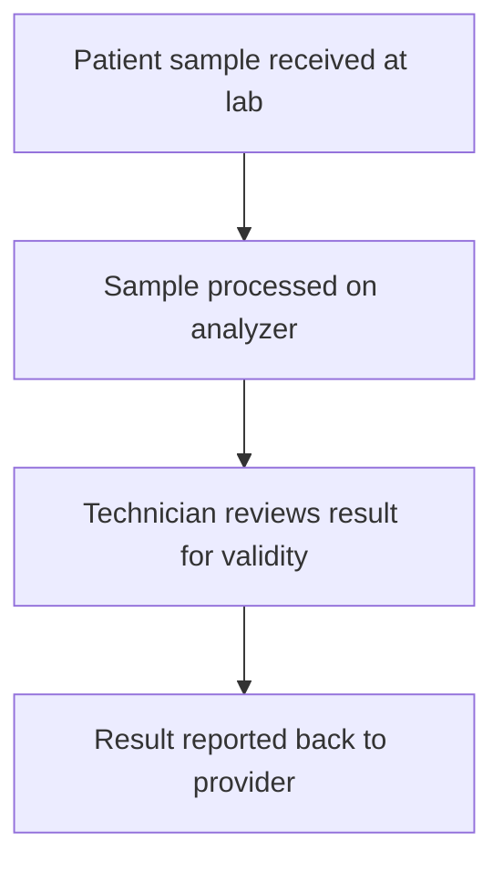
```mermaid
flowchart TD
    A[Patient sample received at lab] --> B[Sample processed on analyzer]
    B --> C[Technician reviews result for validity]
    C --> D[Result reported back to provider]
```
*Pain point: manual review of flagged or unusual results adds time before providers get answers.*

### Companion Diagnostics *(Healthcare)*
Pairing a specific diagnostic test with a matched therapy.
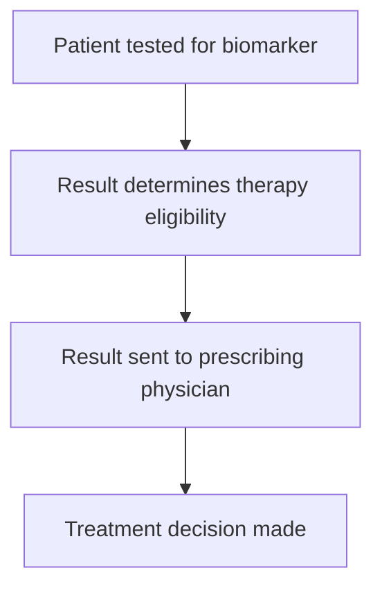
```mermaid
flowchart TD
    A[Patient tested for biomarker] --> B[Result determines therapy eligibility]
    B --> C[Result sent to prescribing physician]
    C --> D[Treatment decision made]
```
*Pain point: turnaround time between testing and result delivery can delay treatment decisions.*

## Clinical Research / CRO Functions

### Site Management *(Healthcare)*
Investigator site selection, monitoring visits.
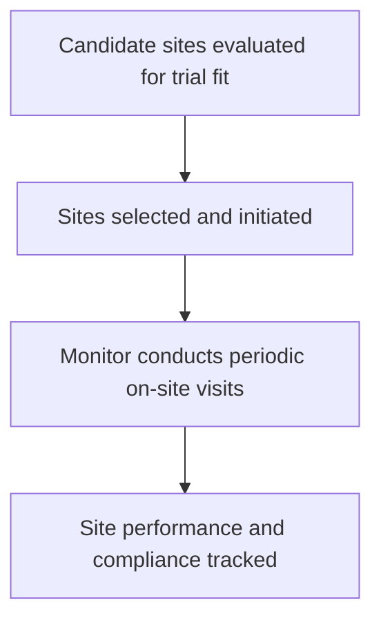
```mermaid
flowchart TD
    A[Candidate sites evaluated for trial fit] --> B[Sites selected and initiated]
    B --> C[Monitor conducts periodic on-site visits]
    C --> D[Site performance and compliance tracked]
```
*Pain point: on-site monitoring visits are manual, expensive, and only sample a portion of site activity.*

### Data Management & Biostatistics
Data cleaning, statistical analysis.
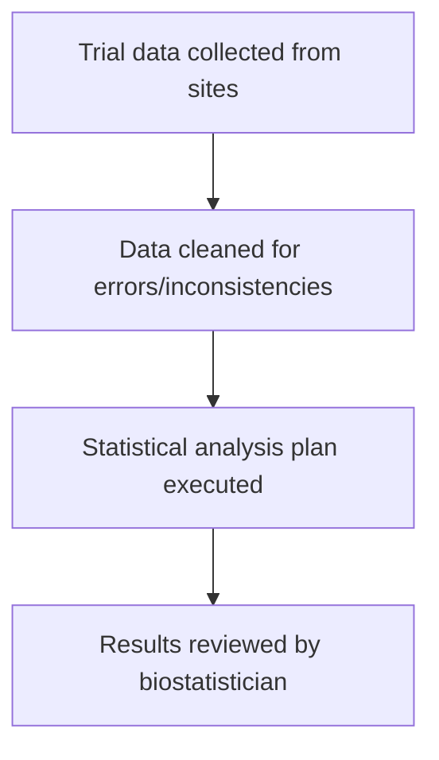
```mermaid
flowchart TD
    A[Trial data collected from sites] --> B[Data cleaned for errors/inconsistencies]
    B --> C[Statistical analysis plan executed]
    C --> D[Results reviewed by biostatistician]
```
*Pain point: data cleaning across many sites and forms is a manual, labor-intensive process before analysis can begin.*

### Trial Supply Management
Investigational product packaging and distribution to sites.
```mermaid
flowchart TD
    A[Investigational product manufactured] --> B[Packaged and labeled per protocol]
    B --> C[Shipped to trial sites]
    C --> D[Site inventory tracked manually against usage]
```
*Pain point: tracking chain of custody and expiry across many sites is a manual, error-prone logistics task.*

## Regulatory Affairs

### Global Regulatory Strategy
Coordinating approval pathways across multiple countries' regulators.
```mermaid
flowchart TD
    A[Product development plan reviewed] --> B[Regulatory strategy mapped per target market]
    B --> C[Filing sequence and timing planned]
    C --> D[Submissions coordinated across regions]
```
*Pain point: tracking differing requirements across many countries' regulators is a manual, expertise-dependent process.*

### Labeling & Packaging Compliance
Ensuring product labeling meets each region's specific requirements.
```mermaid
flowchart TD
    A[Master label content drafted] --> B[Localized for each region's requirements]
    B --> C[Regulatory review per region]
    C --> D[Approved labels sent to manufacturing]
```
*Pain point: localizing and re-reviewing labels for each new region is manual and repetitive.*

### Post-Approval Changes
Managing regulatory filings needed when a product or process changes after approval.
```mermaid
flowchart TD
    A[Change proposed - e.g., manufacturing site] --> B[Impact assessment conducted]
    B --> C[Regulatory filing prepared per region]
    C --> D[Approval obtained before change implemented]
```
*Pain point: assessing which regions require which type of filing for a given change is manually tracked and complex.*

## Quality Assurance & Quality Control

### Quality Management Systems
SOP governance, deviation and CAPA management.
```mermaid
flowchart TD
    A[Deviation from SOP occurs] --> B[Deviation logged and investigated]
    B --> C[Root cause identified]
    C --> D[CAPA plan created and tracked to closure]
```
*Pain point: root cause investigation is a manual process that can take weeks per deviation.*

### Batch Release Testing
Final product testing before market release.
```mermaid
flowchart TD
    A[Batch completes manufacturing] --> B[Samples tested against specification]
    B --> C{Pass?}
    C -->|Yes| D[Batch released]
    C -->|No| E[Batch quarantined, investigated]
```
*Pain point: investigation of a failed batch test is manual and can delay release of an otherwise good batch.*

### Supplier & Vendor Quality Audits
Qualifying and monitoring third-party manufacturers.
```mermaid
flowchart TD
    A[Supplier proposed for qualification] --> B[On-site audit conducted]
    B --> C[Findings documented]
    C --> D[Supplier approved or required to remediate]
```
*Pain point: on-site audits are resource-intensive and only happen periodically, missing issues in between.*

## Pharmacovigilance & Drug Safety

### Adverse Event Reporting
Collecting and reporting safety events tied to a marketed product.
```mermaid
flowchart TD
    A[Adverse event reported by patient/provider] --> B[Case processed and coded manually]
    B --> C[Causality assessed]
    C --> D[Reported to regulators per required timeline]
```
*Pain point: manually coding and assessing causality for each case is labor-intensive at scale.*

### Safety Signal Detection
Analyzing aggregated safety data to spot emerging risk patterns.
```mermaid
flowchart TD
    A[Adverse event database analyzed periodically] --> B[Statistical signal detection run]
    B --> C{Signal identified?}
    C -->|Yes| D[Safety team investigates further]
    C -->|No| E[Continue routine monitoring]
```
*Pain point: signal detection often runs on a periodic batch cycle rather than continuously.*

### Risk Management Plans
Designing programs to mitigate known risks of a product.
```mermaid
flowchart TD
    A[Known risk identified for product] --> B[Mitigation plan designed - e.g., education, restricted use]
    B --> C[Plan implemented and communicated]
    C --> D[Effectiveness monitored periodically]
```
*Pain point: measuring whether a mitigation plan is actually reducing risk in practice is difficult and manual.*

## Commercial (Pharma Sales & Marketing)

### HCP Engagement
Rep detailing, sample management, speaker programs.
```mermaid
flowchart TD
    A[Rep schedules visit with prescriber] --> B[Detailing conversation and materials shared]
    B --> C[Samples provided if applicable]
    C --> D[Visit logged in CRM]
```
*Pain point: rep call planning and prioritization across a territory is often based on stale, periodic data.*

### Market Access
Payer negotiations, formulary placement, prior authorization support.
```mermaid
flowchart TD
    A[Product priced for market] --> B[Payer negotiations conducted per contract]
    B --> C[Formulary placement decided]
    C --> D[Prior authorization criteria set]
    D --> E[Patients navigate PA process for access]
```
*Pain point: prior authorization is a manual, paperwork-heavy process that delays patient access to approved therapies.*

### MLR Review (Medical-Legal-Regulatory)
Promotional material compliance review.
```mermaid
flowchart TD
    A[Marketing drafts promotional material] --> B[Submitted for MLR review]
    B --> C[Medical, legal, regulatory reviewers assess independently]
    C --> D{All approve?}
    D -->|Yes| E[Material approved for use]
    D -->|No| F[Revisions requested, resubmitted]
```
*Pain point: sequential/parallel review across three functions is slow, and revision cycles compound the delay.*

### Commercial Data & Analytics
Sales force effectiveness, territory alignment, HCP targeting.
```mermaid
flowchart TD
    A[Sales and prescribing data collected] --> B[Analyst builds territory/targeting reports]
    B --> C[Reports reviewed with sales leadership]
    C --> D[Territory adjustments made periodically]
```
*Pain point: reports are typically produced on a periodic (monthly/quarterly) cycle, not real time.*

## Medical Affairs

### Medical Science Liaisons (MSLs)
Scientific engagement with key opinion leaders.
```mermaid
flowchart TD
    A[MSL identifies relevant KOL] --> B[Scientific meeting scheduled]
    B --> C[Peer-level discussion conducted]
    C --> D[Insights logged internally]
```
*Pain point: capturing and synthesizing insights from many individual KOL conversations is manual.*

### Publication Planning
Scientific paper/abstract development.
```mermaid
flowchart TD
    A[Study results available] --> B[Manuscript drafted with authors]
    B --> C[Internal review and approval]
    C --> D[Submitted to journal/conference]
```
*Pain point: coordinating input from multiple external authors is a slow, manual back-and-forth.*

### Medical Information
Responding to unsolicited HCP inquiries.
```mermaid
flowchart TD
    A[HCP submits inquiry] --> B[Medical information specialist researches answer]
    B --> C[Response drafted from approved content]
    C --> D[Response sent to HCP]
```
*Pain point: researching and drafting a compliant response for each inquiry individually is manual and repetitive.*

## Health Economics & Outcomes Research (HEOR)

### Cost-Effectiveness Analysis
Evaluating a treatment's value relative to its cost against alternatives.
```mermaid
flowchart TD
    A[Clinical and cost data gathered] --> B[Economic model built]
    B --> C[Cost-effectiveness ratio calculated]
    C --> D[Results submitted to payers/HTA bodies]
```
*Pain point: building and validating the economic model is a manual, specialized modeling exercise.*

### Real-World Evidence Generation *(Healthcare)*
Studying how a treatment performs in everyday clinical practice, drawing on healthcare delivery data.
```mermaid
flowchart TD
    A[Real-world data sourced from health systems] --> B[Data cleaned and structured]
    B --> C[Outcomes analysis conducted]
    C --> D[Findings published or submitted to payers]
```
*Pain point: sourcing and reconciling data from disparate healthcare delivery systems is manual and slow.*

## Patient Services

### Patient Support Programs *(Healthcare)*
Copay assistance, adherence and education programs for patients.
```mermaid
flowchart TD
    A[Patient enrolls in support program] --> B[Eligibility verified manually]
    B --> C[Copay assistance or education materials provided]
    C --> D[Adherence check-ins conducted periodically]
```
*Pain point: eligibility verification and enrollment paperwork is a manual process that can delay patient access.*

### Patient Access Support *(Healthcare)*
Helping patients navigate insurance coverage and reimbursement.
```mermaid
flowchart TD
    A[Patient's insurance coverage checked] --> B[Case manager identifies coverage gaps]
    B --> C[Manager assists with appeals/paperwork]
    C --> D[Coverage resolved or alternative funding found]
```
*Pain point: navigating each payer's unique appeals process is manual and case-manager-dependent.*

## Manufacturing & Supply Chain

### GMP Manufacturing
Production scheduling, batch records.
```mermaid
flowchart TD
    A[Production schedule created] --> B[Batch manufactured per SOP]
    B --> C[Batch record documented manually/electronically]
    C --> D[Record reviewed before batch release]
```
*Pain point: batch record review for completeness and accuracy is a manual, time-consuming quality check.*

### Contract Manufacturing (CMO/CDMO)
Outsourcing drug or device production to a specialized third-party manufacturer.
```mermaid
flowchart TD
    A[Sponsor selects CMO/CDMO partner] --> B[Technology transfer conducted]
    B --> C[CMO manufactures per agreed process]
    C --> D[Sponsor's quality team reviews batch records]
```
*Pain point: technology transfer to a new manufacturing partner is a lengthy, manual knowledge-transfer process.*

### Cold Chain Logistics
Temperature-controlled distribution.
```mermaid
flowchart TD
    A[Product packed with temperature monitoring] --> B[Shipped through cold chain network]
    B --> C[Temperature logs checked on arrival]
    C --> D{Excursion detected?}
    D -->|Yes| E[Product investigated, possibly discarded]
    D -->|No| F[Product released for use]
```
*Pain point: temperature excursions are often only discovered after delivery, when the log is manually reviewed.*

### Serialization & Track-and-Trace
Anti-counterfeiting compliance.
```mermaid
flowchart TD
    A[Unique serial number applied to product] --> B[Serial number registered in tracking system]
    B --> C[Number verified at each supply chain handoff]
    C --> D[Product dispensed, final scan recorded]
```
*Pain point: verifying serial numbers across many supply chain partners requires manual reconciliation when systems don't integrate cleanly.*

## Licensing & Business Development

### In-Licensing / Out-Licensing
Acquiring rights to external drug candidates or licensing out internal ones.
```mermaid
flowchart TD
    A[Candidate asset identified for licensing] --> B[Due diligence conducted]
    B --> C[Deal terms negotiated]
    C --> D[Licensing agreement signed]
```
*Pain point: due diligence on external assets requires manually reviewing extensive scientific and legal documentation.*

### Partnership & Alliance Management
Managing co-development and commercialization agreements between companies.
```mermaid
flowchart TD
    A[Partnership agreement established] --> B[Joint governance committee formed]
    B --> C[Progress reviewed at periodic meetings]
    C --> D[Decisions documented and tracked]
```
*Pain point: tracking obligations and decisions across a long-running partnership is manually maintained and easy to lose track of.*

## Animal Health

### Veterinary Pharmaceuticals
Drug development for livestock and companion animals.
```mermaid
flowchart TD
    A[Target condition identified in animal species] --> B[Compound developed and tested]
    B --> C[Regulatory approval sought - typically faster pathway]
    C --> D[Product launched to veterinarians]
```
*Pain point: species-specific efficacy and safety testing must be manually repeated for each target animal.*

### Livestock Health Management
Disease prevention and treatment programs for agricultural animals.
```mermaid
flowchart TD
    A[Herd health monitored by farm staff] --> B[Disease symptoms observed]
    B --> C[Veterinarian consulted, treatment prescribed]
    C --> D[Treatment administered and outcome tracked]
```
*Pain point: early disease detection relies on manual observation by farm staff, which can miss subtle signs.*

## Consumer Health / Nutraceuticals

### OTC Product Development
Formulating and launching over-the-counter health products.
```mermaid
flowchart TD
    A[Product concept and formulation developed] --> B[Safety and efficacy testing conducted]
    B --> C[Regulatory pathway confirmed - lighter than Rx]
    C --> D[Product launched to retail]
```
*Pain point: formulation iteration and stability testing cycles are manual and can take many rounds.*

### Dietary Supplements
Formulation, claims substantiation, regulatory compliance.
```mermaid
flowchart TD
    A[Supplement formulated] --> B[Scientific literature gathered to substantiate claims]
    B --> C[Compliance review of labeling and claims]
    C --> D[Product launched]
```
*Pain point: substantiating health claims from scientific literature is a manual research and documentation process.*
