# Retail Sector — Full Breakdown with Traditional Process Flows

Each sub-function below includes: a two-line description, a Mermaid flowchart of how the process traditionally runs today, and the main pain point in that traditional flow.

## E-commerce / Online Retail

### Product Catalog Management
Creating and categorizing SKUs with accurate content and imagery. Keeps product data consistent across every sales channel.
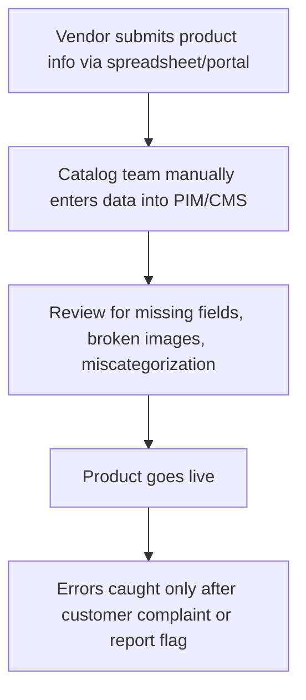
```mermaid
flowchart TD
    A[Vendor submits product info via spreadsheet/portal] --> B[Catalog team manually enters data into PIM/CMS]
    B --> C[Review for missing fields, broken images, miscategorization]
    C --> D[Product goes live]
    D --> E[Errors caught only after customer complaint or report flag]
```
*Pain point: catalog data arrives in inconsistent formats from many vendors, so standardization is manual and slow.*

### Order Management
Capturing orders and routing them to the right fulfillment location. Tracks order status through to delivery.
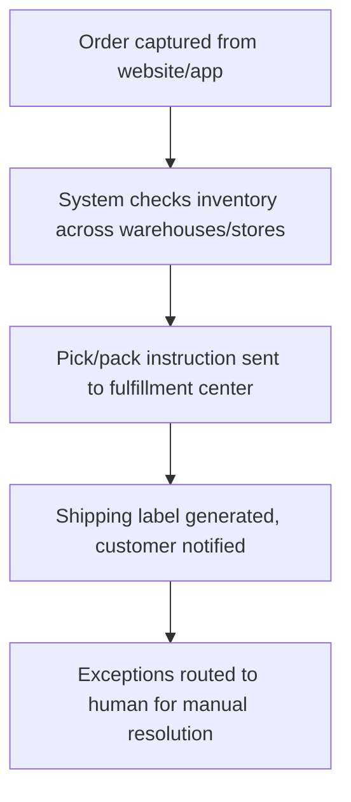
```mermaid
flowchart TD
    A[Order captured from website/app] --> B[System checks inventory across warehouses/stores]
    B --> C[Pick/pack instruction sent to fulfillment center]
    C --> D[Shipping label generated, customer notified]
    D --> E[Exceptions routed to human for manual resolution]
```
*Pain point: exception handling is almost entirely manual — someone has to notice and intervene.*

### Cart & Checkout Optimization
Integrating payment methods and reducing friction at checkout. Includes recovering abandoned carts through follow-up messaging.
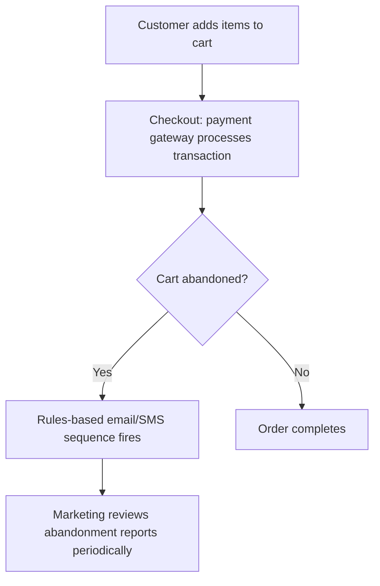
```mermaid
flowchart TD
    A[Customer adds items to cart] --> B[Checkout: payment gateway processes transaction]
    B --> C{Cart abandoned?}
    C -->|Yes| D[Rules-based email/SMS sequence fires]
    C -->|No| E[Order completes]
    D --> F[Marketing reviews abandonment reports periodically]
```
*Pain point: recovery sequences are generic, not tailored to why that specific customer dropped off.*

### Website/App Merchandising
Powering on-site search, recommendations, and personalization. Shapes what products a shopper sees based on behavior.
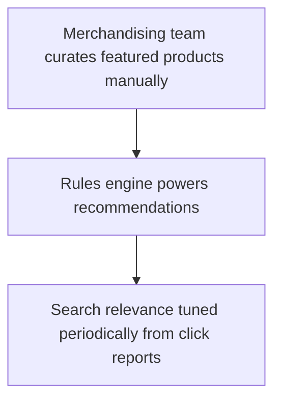
```mermaid
flowchart TD
    A[Merchandising team curates featured products manually] --> B[Rules engine powers recommendations]
    B --> C[Search relevance tuned periodically from click reports]
```
*Pain point: manual curation can't keep pace with real-time inventory or trending changes.*

### Marketplace Operations
Managing third-party sellers on a retailer's own online marketplace. Handles seller onboarding, commissions, and listing quality.
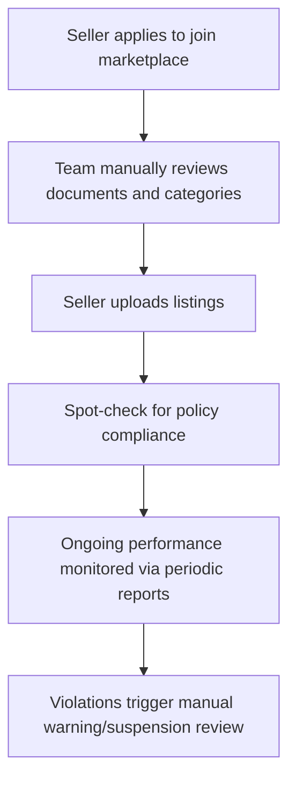
```mermaid
flowchart TD
    A[Seller applies to join marketplace] --> B[Team manually reviews documents and categories]
    B --> C[Seller uploads listings]
    C --> D[Spot-check for policy compliance]
    D --> E[Ongoing performance monitored via periodic reports]
    E --> F[Violations trigger manual warning/suspension review]
```
*Pain point: seller quality monitoring is largely reactive — problems surface after complaints accumulate.*

### Subscription Commerce
Running recurring subscription-box or replenishment offerings. Manages billing cycles and subscriber retention.
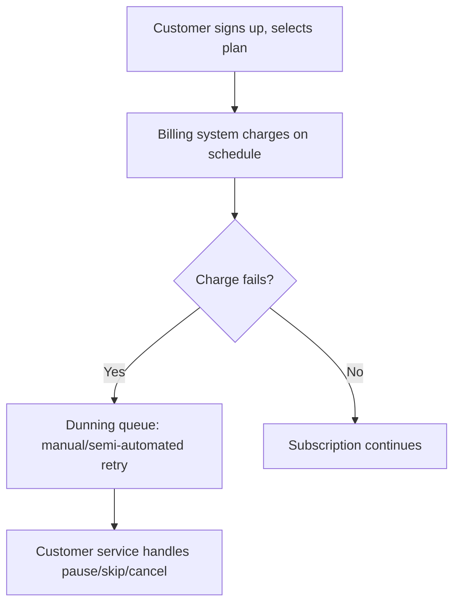
```mermaid
flowchart TD
    A[Customer signs up, selects plan] --> B[Billing system charges on schedule]
    B --> C{Charge fails?}
    C -->|Yes| D[Dunning queue: manual/semi-automated retry]
    C -->|No| E[Subscription continues]
    D --> F[Customer service handles pause/skip/cancel]
```
*Pain point: skip/pause/cancel requests still often require a live agent instead of self-service.*

## Brick-and-Mortar / Physical Retail

### Store Operations
Staffing and scheduling stores and running daily opening/closing procedures. Keeps the store compliant with operational standards.
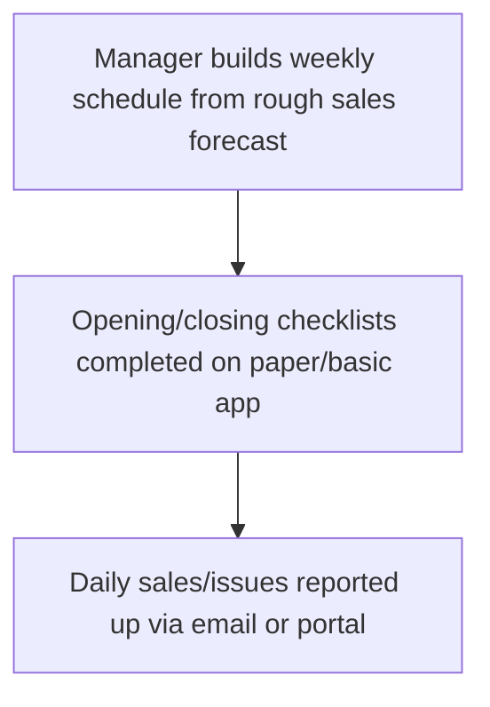
```mermaid
flowchart TD
    A[Manager builds weekly schedule from rough sales forecast] --> B[Opening/closing checklists completed on paper/basic app]
    B --> C[Daily sales/issues reported up via email or portal]
```
*Pain point: scheduling is often reactive to last week's traffic rather than predictive.*

### Visual Merchandising
Executing planograms and designing in-store displays. Shapes how products are presented to drive purchases.
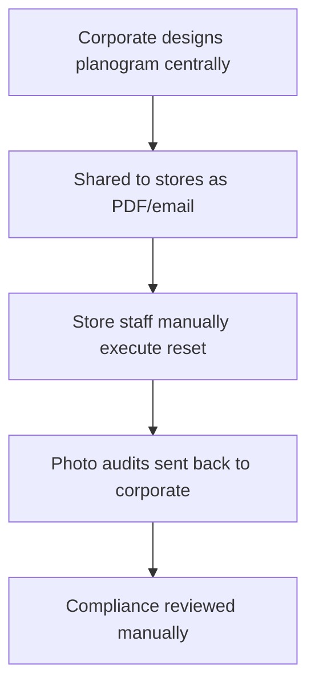
```mermaid
flowchart TD
    A[Corporate designs planogram centrally] --> B[Shared to stores as PDF/email]
    B --> C[Store staff manually execute reset]
    C --> D[Photo audits sent back to corporate]
    D --> E[Compliance reviewed manually]
```
*Pain point: verifying planogram compliance across hundreds of stores is slow and inconsistent.*

### Point-of-Sale Operations
Processing in-store transactions and handling returns at checkout. Reconciles daily cash and card totals.
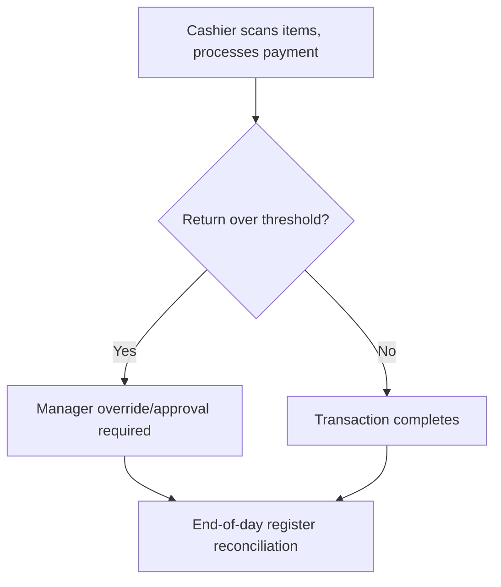
```mermaid
flowchart TD
    A[Cashier scans items, processes payment] --> B{Return over threshold?}
    B -->|Yes| C[Manager override/approval required]
    B -->|No| D[Transaction completes]
    C --> E[End-of-day register reconciliation]
    D --> E
```
*Pain point: reconciliation discrepancies require manual investigation, often the next business day.*

## Omnichannel & Fulfillment

### Buy Online, Pick Up In Store (BOPIS)
Routing online orders to a nearby store for pickup. Coordinates inventory visibility between online and in-store systems.
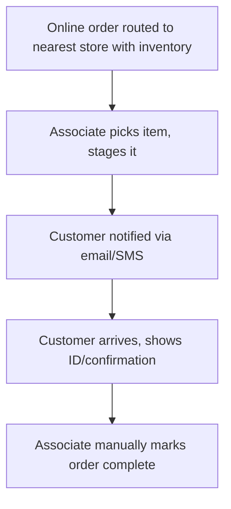
```mermaid
flowchart TD
    A[Online order routed to nearest store with inventory] --> B[Associate picks item, stages it]
    B --> C[Customer notified via email/SMS]
    C --> D[Customer arrives, shows ID/confirmation]
    D --> E[Associate manually marks order complete]
```
*Pain point: "in stock" online doesn't always match the shelf reality, causing pickup failures.*

### Ship-from-Store
Using a physical store's inventory to fulfill an online order. Reduces shipping distance and speeds delivery.
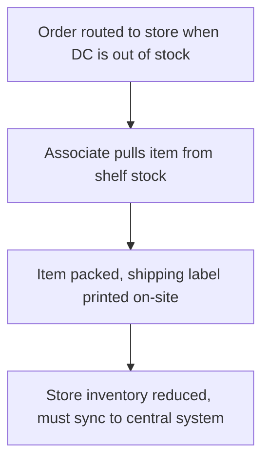
```mermaid
flowchart TD
    A[Order routed to store when DC is out of stock] --> B[Associate pulls item from shelf stock]
    B --> C[Item packed, shipping label printed on-site]
    C --> D[Store inventory reduced, must sync to central system]
```
*Pain point: pulling shelf stock for shipping can create in-store stockouts if inventory sync lags.*

### Cross-Channel Returns
Accepting an item bought online back at a physical store. Requires unified return policies and inventory reconciliation across channels.
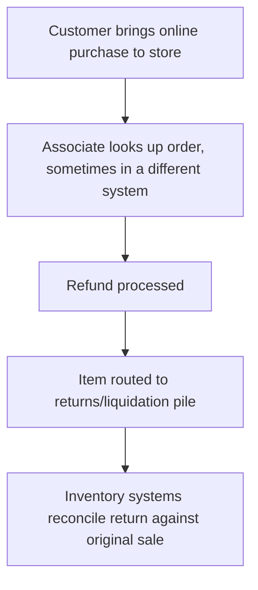
```mermaid
flowchart TD
    A[Customer brings online purchase to store] --> B[Associate looks up order, sometimes in a different system]
    B --> C[Refund processed]
    C --> D[Item routed to returns/liquidation pile]
    D --> E[Inventory systems reconcile return against original sale]
```
*Pain point: reconciling an online sale against an in-store return often means bridging two separate systems manually.*

## Merchandising & Supply Chain

### Demand Planning & Forecasting
Predicting future sales to guide inventory and staffing decisions. Accounts for seasonality and promotional lift.
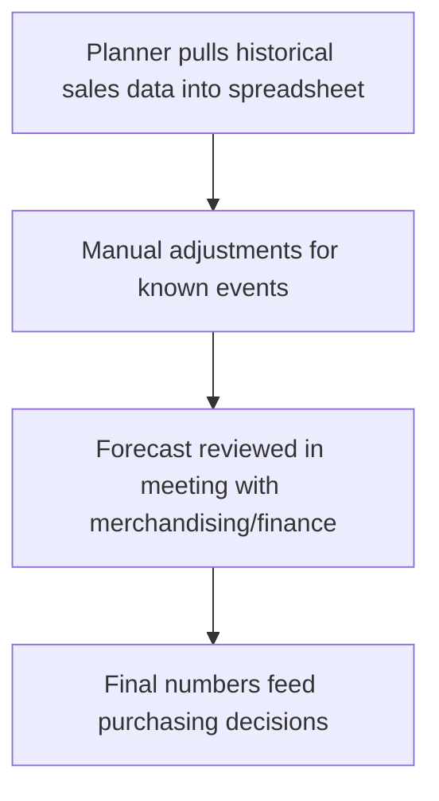
```mermaid
flowchart TD
    A[Planner pulls historical sales data into spreadsheet] --> B[Manual adjustments for known events]
    B --> C[Forecast reviewed in meeting with merchandising/finance]
    C --> D[Final numbers feed purchasing decisions]
```
*Pain point: forecasts are usually built at a slower cadence (weekly/monthly) than actual demand shifts.*

### Assortment Planning
Deciding which products to carry in which stores or regions. Balances local demand against supply chain complexity.
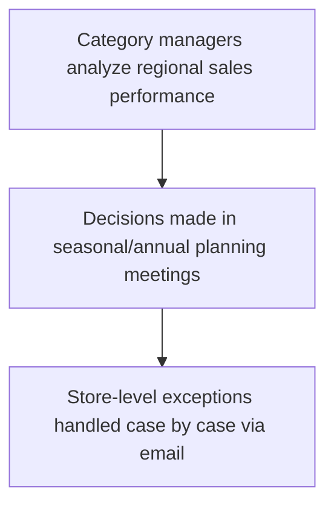
```mermaid
flowchart TD
    A[Category managers analyze regional sales performance] --> B[Decisions made in seasonal/annual planning meetings]
    B --> C[Store-level exceptions handled case by case via email]
```
*Pain point: assortment decisions lag behind fast-moving local trends.*

### Inventory Management
Replenishing stock and maintaining safety stock levels. Uses cycle counts to catch discrepancies before they compound.
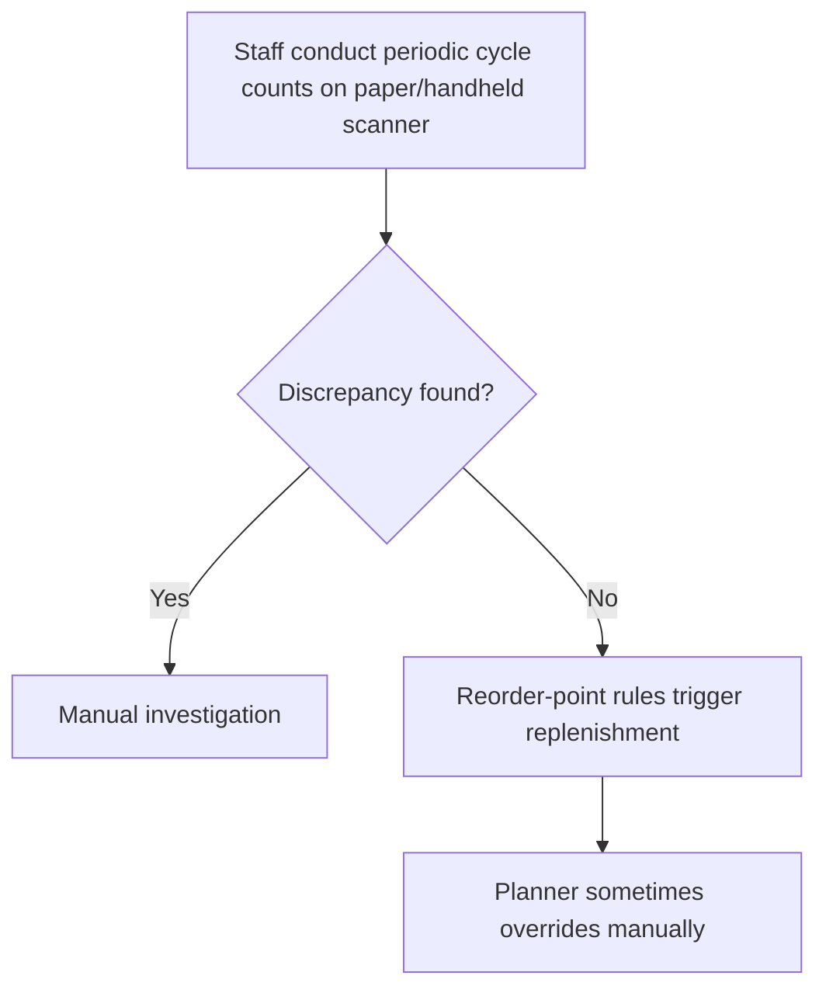
```mermaid
flowchart TD
    A[Staff conduct periodic cycle counts on paper/handheld scanner] --> B{Discrepancy found?}
    B -->|Yes| C[Manual investigation]
    B -->|No| D[Reorder-point rules trigger replenishment]
    D --> E[Planner sometimes overrides manually]
```
*Pain point: cycle counts are sampled, not exhaustive, so shrinkage and errors can go undetected for a while.*

### Vendor/Supplier Management
Sourcing suppliers and managing the purchase order process. Negotiates pricing and monitors supplier performance.
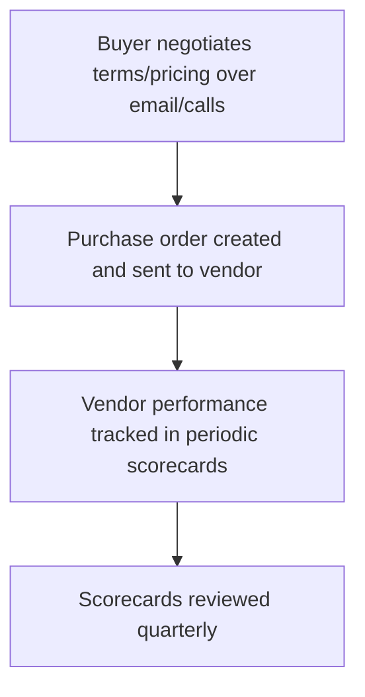
```mermaid
flowchart TD
    A[Buyer negotiates terms/pricing over email/calls] --> B[Purchase order created and sent to vendor]
    B --> C[Vendor performance tracked in periodic scorecards]
    C --> D[Scorecards reviewed quarterly]
```
*Pain point: vendor performance issues are usually caught in a lagging quarterly review, not in real time.*

### Warehouse & Distribution
Receiving, picking, packing, and shipping goods from distribution centers. Coordinates last-mile delivery to stores or customers.
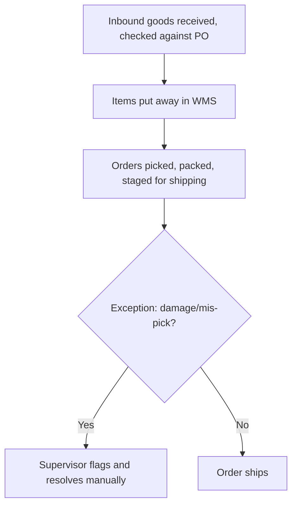
```mermaid
flowchart TD
    A[Inbound goods received, checked against PO] --> B[Items put away in WMS]
    B --> C[Orders picked, packed, staged for shipping]
    C --> D{Exception: damage/mis-pick?}
    D -->|Yes| E[Supervisor flags and resolves manually]
    D -->|No| F[Order ships]
```
*Pain point: exception resolution depends on a supervisor noticing and intervening in real time.*

### Private Label / Product Development
Sourcing and developing a retailer's own store-brand products. Manages the product lifecycle from concept to shelf.
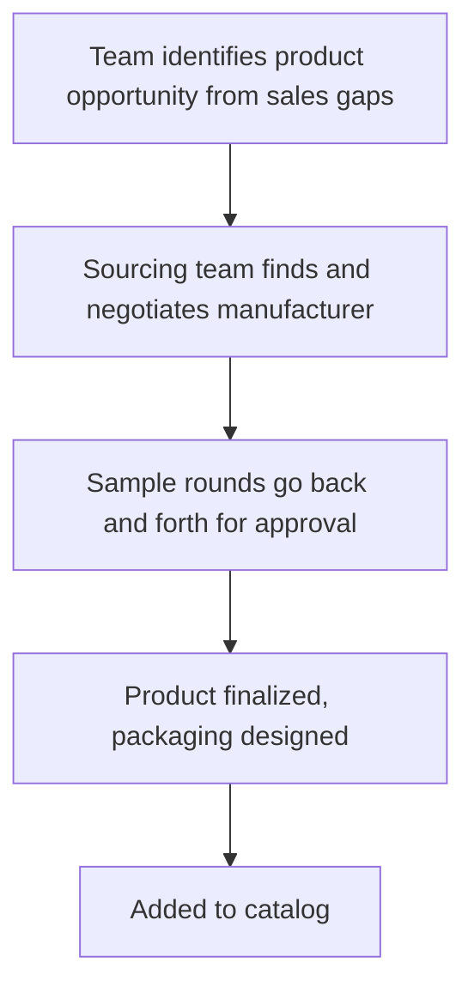
```mermaid
flowchart TD
    A[Team identifies product opportunity from sales gaps] --> B[Sourcing team finds and negotiates manufacturer]
    B --> C[Sample rounds go back and forth for approval]
    C --> D[Product finalized, packaging designed]
    D --> E[Added to catalog]
```
*Pain point: the sample-approval loop with manufacturers is slow and highly manual (emails, physical samples shipped back and forth).*

## Pricing & Promotions

### Price Optimization
Setting prices based on competitor moves and demand elasticity. Adjusts dynamically as market conditions shift.
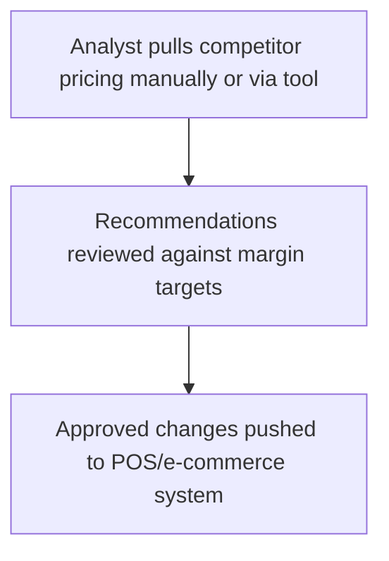
```mermaid
flowchart TD
    A[Analyst pulls competitor pricing manually or via tool] --> B[Recommendations reviewed against margin targets]
    B --> C[Approved changes pushed to POS/e-commerce system]
```
*Pain point: competitor price checks are often periodic snapshots, not continuous.*

### Markdown Management
Discounting end-of-season or slow-moving inventory. Times markdowns to clear stock while protecting margin.
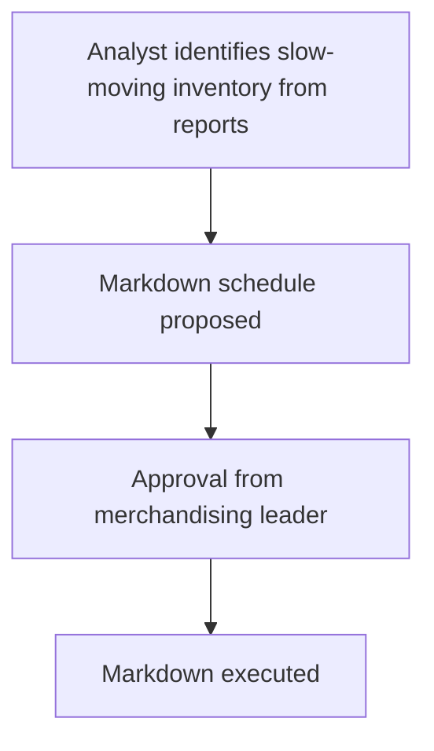
```mermaid
flowchart TD
    A[Analyst identifies slow-moving inventory from reports] --> B[Markdown schedule proposed]
    B --> C[Approval from merchandising leader]
    C --> D[Markdown executed]
```
*Pain point: markdown timing is often reactive rather than predictive of what won't sell.*

### Promotion Planning
Designing discount campaigns and coordinating their timing. Measures promotional lift against the cost of the discount.
```mermaid
flowchart TD
    A[Marketing and merchandising plan promotional calendar] --> B[Creative and pricing teams execute separately]
    B --> C[Promotion runs]
    C --> D[Results compiled into report after the fact]
```
*Pain point: measuring true incremental lift (vs. sales that would've happened anyway) is usually a rough manual estimate.*

## Marketing & Brand

### Advertising & Media Buying
Planning and purchasing paid campaigns across digital and traditional channels. Allocates budget to the channels driving the best return.
```mermaid
flowchart TD
    A[Marketing sets budget and campaign brief] --> B[Media buyer negotiates placements across channels]
    B --> C[Campaign runs]
    C --> D[Performance reviewed in separate platform dashboards]
```
*Pain point: stitching together performance across many ad platforms into one view is manual.*

### Brand Management
Maintaining consistent positioning and visual identity across touchpoints. Guards brand guidelines across every campaign and partner.
```mermaid
flowchart TD
    A[Brand guidelines documented centrally] --> B[Every new asset manually reviewed against guidelines]
    B --> C{Violation found post-launch?}
    C -->|Yes| D[Correction request sent back to creator]
    C -->|No| E[Asset stands]
```
*Pain point: brand review is a bottleneck when many teams are producing content in parallel.*

### Social Media & Influencer Marketing
Building content strategy and managing creator partnerships. Drives discovery and engagement outside owned channels.
```mermaid
flowchart TD
    A[Team identifies and negotiates with creators] --> B[Content briefed, drafted by creator]
    B --> C[Reviewed before posting]
    C --> D[Performance tracked manually per platform]
```
*Pain point: performance tracking across dozens of creators and platforms isn't centralized.*

## Customer Experience

### Customer Service/Support
Handling returns, complaints, and inquiries via chat, phone, or email. Resolves issues in a way that protects customer loyalty.
```mermaid
flowchart TD
    A[Customer contacts via phone/chat/email] --> B[Agent looks up order across possibly multiple systems]
    B --> C[Agent resolves using judgment and policy docs]
    C --> D[Case logged, sometimes inconsistently, in CRM]
```
*Pain point: agents often need to jump between systems to get a full picture of a customer's history.*

### Loyalty Programs
Running points-based or tiered reward programs. Uses purchase history to personalize offers and retain customers.
```mermaid
flowchart TD
    A[Customer enrolls at checkout/app sign-up] --> B[Points accrue automatically per purchase]
    B --> C{Tier/redemption threshold reached?}
    C -->|Discrepancy| D[Manual correction needed]
    C -->|Correct| E[Reward applied]
```
*Pain point: point/tier discrepancies (common after returns or system syncing issues) require manual fixing.*

### Customer Data & CRM
Segmenting customers and powering personalization engines. Centralizes customer behavior data across channels.
```mermaid
flowchart TD
    A[Data streams from POS, website, app, loyalty separately] --> B[Analysts periodically merge/reconcile]
    B --> C[Segments built manually for campaigns]
```
*Pain point: a "single customer view" is often stitched together in batches, not real time.*

## Loss Prevention & Risk

### Shrinkage Management
Preventing and detecting theft, both external and internal. Uses audits and surveillance to keep inventory loss in check.
```mermaid
flowchart TD
    A[LP staff review footage and discrepancy reports] --> B[Suspicious patterns flagged for investigation]
    B --> C[Periodic physical audits true-up inventory]
```
*Pain point: footage review is time-intensive and mostly reactive to already-flagged discrepancies.*

### Fraud Detection
Identifying return fraud and payment fraud patterns. Balances fraud prevention against a smooth customer experience.
```mermaid
flowchart TD
    A[Rules-based system flags suspicious orders/returns] --> B[Fraud analyst manually reviews flagged cases]
    B --> C[Decision: approve, hold, or cancel]
```
*Pain point: rules-based flagging produces false positives that still require manual review time.*

## Retail-Adjacent Commercial Functions

### Retail Media/Advertising
Selling sponsored product placement within the retailer's own platform. Has become a significant profit center for large retailers.
```mermaid
flowchart TD
    A[Brand/vendor requests ad placement] --> B[Sales team negotiates terms and ad slots]
    B --> C[Campaign manually trafficked]
    C --> D[Performance reported back to vendor]
```
*Pain point: campaign trafficking and reporting across many vendor campaigns is manual and time-consuming.*

### Store P&L Management
Tracking profitability at the individual store level. Informs decisions on staffing, hours, and even store closures.
```mermaid
flowchart TD
    A[Sales, labor, cost data pulled from multiple systems] --> B[Regional finance compiles P&L report]
    B --> C[Underperforming stores flagged in leadership meeting]
```
*Pain point: the P&L is often a lagging snapshot rather than a real-time view of store health.*

## Workforce Management

### Hiring & Onboarding
Recruiting and training store and warehouse staff. Manages the ramp-up period for new hires to reach full productivity.
```mermaid
flowchart TD
    A[Manager posts openings, screens applications] --> B[Interviews scheduled and conducted]
    B --> C[New hire completes paperwork and training]
```
*Pain point: onboarding paperwork and training completion is hard to track consistently across stores.*

### Scheduling & Labor Planning
Building staff schedules against forecasted customer traffic. Balances labor cost against service-level targets.
```mermaid
flowchart TD
    A[Manager estimates labor hours from sales forecast] --> B[Shifts built manually or with basic software]
    B --> C{Last-minute call-out?}
    C -->|Yes| D[Manager scrambles for coverage via group text]
    C -->|No| E[Schedule runs as planned]
```
*Pain point: last-minute coverage gaps are handled ad hoc, with no systematic backup plan.*

## Real Estate & Store Development

### Site Selection
Analyzing markets and demographics to choose new store locations. Weighs foot traffic potential against lease cost.
```mermaid
flowchart TD
    A[Team analyzes demographic/traffic data] --> B[Site visits conducted in person]
    B --> C[Recommendation presented to leadership]
```
*Pain point: demographic/traffic analysis often relies on third-party reports that lag real conditions.*

### Lease Negotiation
Negotiating commercial lease terms and renewal options. Manages the portfolio of lease obligations over time.
```mermaid
flowchart TD
    A[Legal and real estate negotiate with landlord] --> B[Several rounds of redlines over email]
    B --> C[Signed lease filed]
    C --> D[Key dates tracked, often in spreadsheet]
```
*Pain point: lease renewal/escalation dates tracked in spreadsheets are easy to miss.*

### Store Buildout & Design
Overseeing construction, fixtures, and layout for a new or renovated store. Coordinates contractors and timelines to hit opening dates.
```mermaid
flowchart TD
    A[Design team creates store layout plans] --> B[Contractors hired, construction scheduled]
    B --> C[PM tracks timeline/budget via spreadsheets and site visits]
```
*Pain point: buildout delays are often discovered only when someone checks in, not proactively flagged.*

## Sustainability & Ethical Sourcing

### Supply Chain Traceability
Verifying and auditing where sourced materials actually come from. Supports ethical sourcing claims made to customers.
```mermaid
flowchart TD
    A[Sourcing team requests certifications/audits from suppliers] --> B[Documents reviewed manually]
    B --> C[Periodic third-party audits verify claims on-site]
```
*Pain point: verifying claims deep in a multi-tier supply chain (beyond direct suppliers) is very difficult manually.*

### Sustainable Packaging & Operations
Reducing waste and choosing lower-impact materials. Increasingly factors into both cost and brand reputation.
```mermaid
flowchart TD
    A[Packaging team evaluates material options] --> B[Pilot tests run with subset of shipments]
    B --> C[Rollout decision based on pilot results and cost]
```
*Pain point: measuring the actual environmental impact of a packaging change is hard to do precisely.*

## International / Global Retail Operations

### Market Entry & Localization
Adapting assortment, pricing, and operations for a new country market. Accounts for local consumer preferences and regulations.
```mermaid
flowchart TD
    A[Team researches local preferences, regulations, competitors] --> B[Assortment/pricing adapted via local experts]
    B --> C[Local operations built out market by market]
```
*Pain point: localization decisions rely heavily on local expert judgment rather than centralized data.*

### Cross-Border Logistics
Managing customs, duties, and international shipping for fulfillment. Adds complexity and cost compared to domestic-only fulfillment.
```mermaid
flowchart TD
    A[Shipment prepared with customs documentation] --> B[Customs broker manages clearance]
    B --> C[Duties/taxes calculated and paid]
    C --> D{Documentation error?}
    D -->|Yes| E[Shipment held at customs, discovered after the fact]
    D -->|No| F[Shipment clears]
```
*Pain point: documentation errors can hold up shipments at customs for days, discovered only after the fact.*
