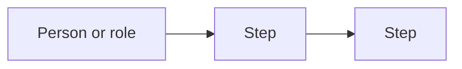
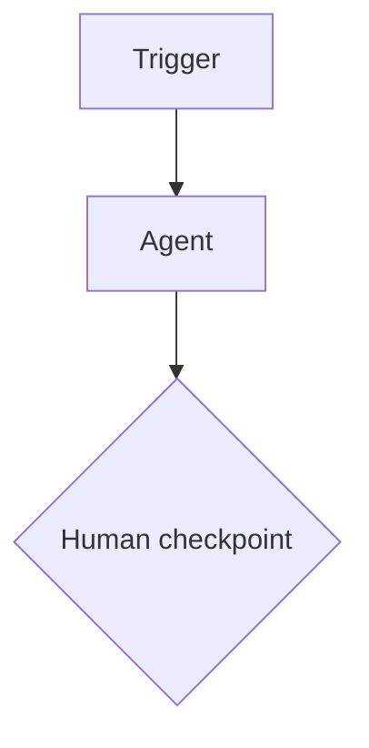

# How to publish a What-If redesign

1. Find the process page you want to redesign, for example
   `retail/product-catalog-management.html`.
2. Copy this file to `content/redesigns/<sector folder>/<same file name>.md`, for example
   `content/redesigns/retail/product-catalog-management.md`.
   Sector folders are `retail`, `financial` and `life-sciences`.
3. Fill in the sections below. Keep the `## ` headings exactly as written.
   You can leave a section out and it will keep showing "Coming soon".
4. Run `python3 scripts/build_site.py` and push. The page, the sector page and the
   home page counter update automatically.

Supported formatting: paragraphs, `### subheadings`, bullet and numbered lists,
tables, **bold**, *italic*, links, and ```mermaid diagrams (they get the zoom view).

Everything above the first `## ` heading is ignored, so you can delete these notes.

## Tools in use today

- **Tool or system** — what it is used for in this process

## Pain points in depth

### Pain point name
Where it happens, who feels it, and what it costs in time, errors or risk.

## Today's critical user journey



Where the delays and errors creep in.

## The What-If agent ecosystem

| Agent | Single responsibility |
|---|---|
| Example Agent | What it does, and nothing else |



## The new critical user journey

What changes for each person, and where they still step in.

## Before and after

| | Before | After |
|---|---|---|
| Example dimension | How it works today | How it works with agents |

## How each pain point gets solved

| Pain point | Solved by |
|---|---|
| Pain point name | Agent or checkpoint that removes it |

## Business outcomes

Generic outcomes this redesign could drive. Label any figures as illustrative
estimates, never as measured results.
